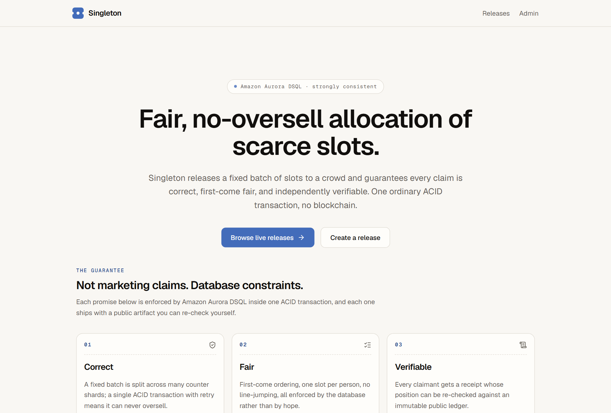
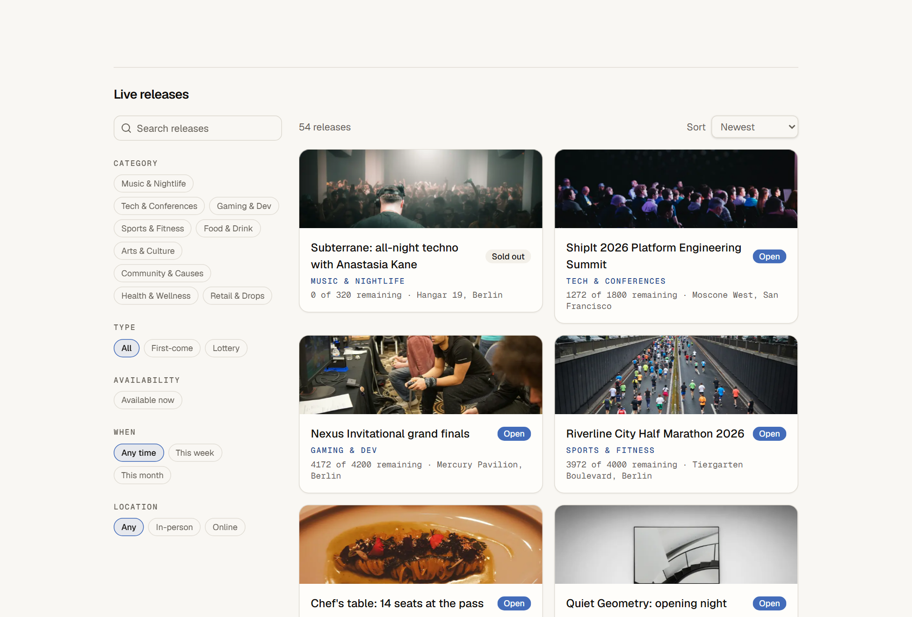
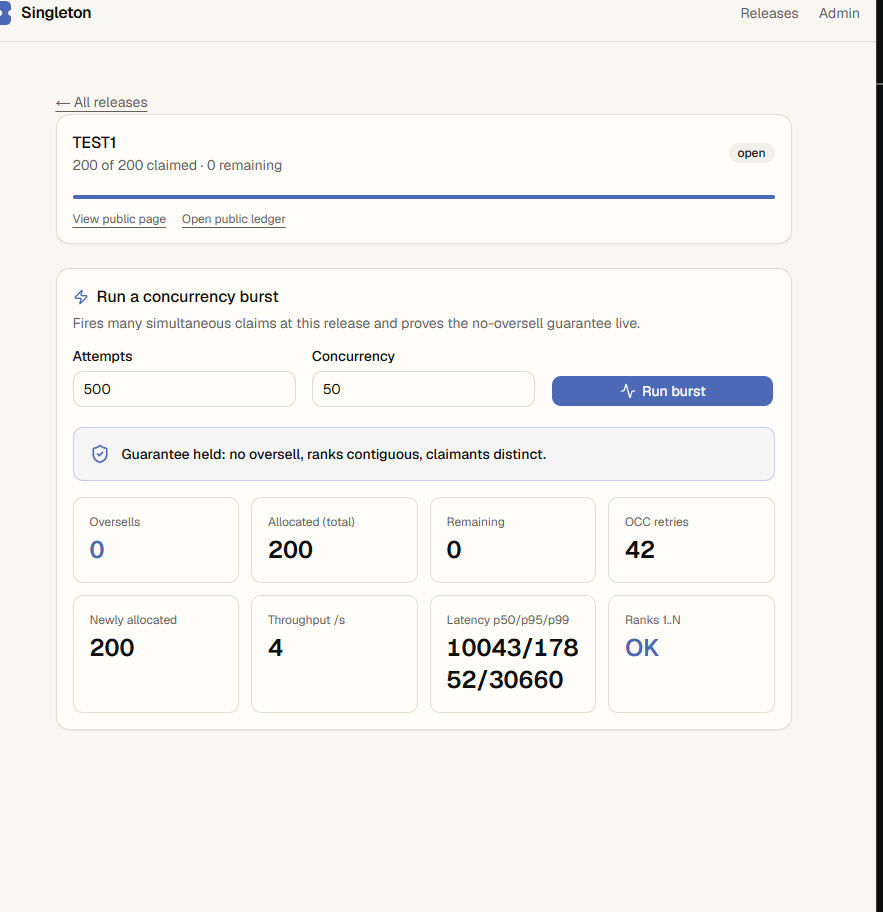
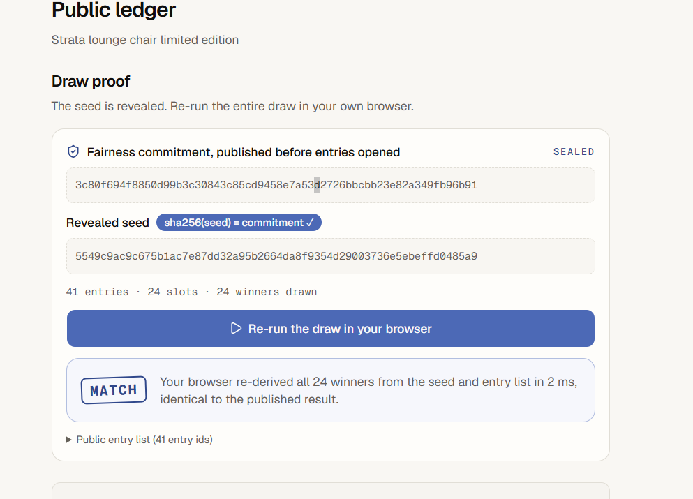
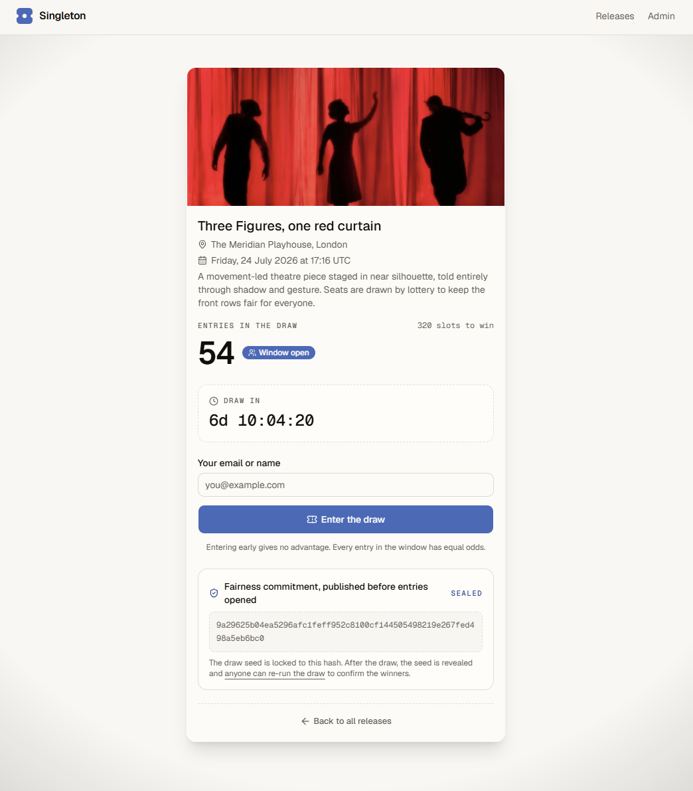

<div align="center">

# Singleton

### Provably-fair, no-oversell allocation of scarce slots, on Amazon Aurora DSQL.

Tickets, clinic appointments, limited drops. Released to a crowd, **never oversold**, and **verifiable by anyone**.

[](https://singleton-six.vercel.app)
&nbsp;[](https://nextjs.org)
&nbsp;[](https://aws.amazon.com/rds/aurora/dsql/)
&nbsp;[](https://www.typescriptlang.org)

[**Live demo**](https://singleton-six.vercel.app) · [Technical deep-dive](docs/INTEL.md) · [Architecture](docs/architecture.png) · [Submission notes](docs/SUBMISSION.md)



</div>

---

## What it is

Every high-demand release hits the same bug: a clinic double-books an appointment, a venue sells more tickets than it has, a drop crashes and no one can prove the winners were fair. Counting one scarce resource under a crowd is genuinely hard.

**Singleton makes it the easy path.** A provider releases a fixed batch of slots and gets three guarantees:

- **Correct:** the batch can never oversell, no matter how many people claim at the same instant.
- **Fair:** strict first-come order, or equal odds inside an entry window. One slot per person, no line-jumping.
- **Verifiable:** every claimant gets a receipt whose rank is re-checkable against a public ledger, and a lottery's entire winner list can be recomputed in the visitor's own browser.

> **Why Amazon Aurora DSQL?** Guaranteeing "never oversell" under a flash crowd needs strong consistency **and** serverless scale at the same time. Aurora DSQL gives both, so the whole guarantee collapses into one ordinary ACID transaction (a sharded conditional decrement with optimistic-concurrency retry) instead of a Redis lock, a queue, or a reconciliation job.

It is also a **multi-tenant marketplace**: operators self-register and manage only their own releases (server-enforced), browsable through a category filter rail. The front end was scaffolded with **v0** and deployed on **Vercel** in the same region as the cluster.

---

## See it work

<table>
  <tr>
    <td width="50%" valign="top">
      <br>
      <b>A real marketplace</b><br>
      <sub>54 live releases across 9 categories, with a search, category, type, availability, date, and location filter rail.</sub>
    </td>
    <td width="50%" valign="top">
      <br>
      <b>No oversell, proven live</b><br>
      <sub>Fire 500 simultaneous claims at a 200-slot release: exactly 200 allocated, <b>0 oversells</b>, ranks contiguous, with the OCC retries it absorbed. The stress harness pushes this to 10,000.</sub>
    </td>
  </tr>
  <tr>
    <td width="50%" valign="top">
      <br>
      <b>Fairness you can verify yourself</b><br>
      <sub>A commit-reveal lottery. The seed's hash is sealed before entries open; after the draw, anyone re-runs the whole draw in their browser and sees <b>MATCH</b>, byte for byte.</sub>
    </td>
    <td width="50%" valign="top">
      <br>
      <b>Immersive, branded release pages</b><br>
      <sub>Each release renders its poster as a vignetted background behind a translucent glass card, with a live count and a public ledger link.</sub>
    </td>
  </tr>
</table>

---

## How the guarantee works

<div align="center">

</div>

A release's `capacity` is split across `shard_count` counter rows (`release_shards`). A claim:

1. short-circuits if the claimant already holds a slot (idempotent, no write);
2. picks a **random shard order** and, per shard, runs one transaction:
   `UPDATE release_shards SET remaining = remaining - 1 WHERE … AND remaining > 0 RETURNING id`,
   then `INSERT` the allocation, then `COMMIT`;
3. retries the whole claim on a commit-time **OCC conflict** (`SQLSTATE 40001` / `OC000`) with exponential backoff + jitter;
4. joins a fair **waitlist** when every shard is empty (sold out).

A single hot counter melts under Aurora DSQL's optimistic concurrency control, so sharding the counter is the one load-bearing decision. The `CHECK (remaining >= 0)` constraint plus the conditional decrement make oversell impossible; the unique index on `(release_id, claimant_id)` makes a retried claim idempotent. Ranks are **derived** from `(claimed_at, id)` order, never stored, so they are exactly `1..allocated`.

See [`src/domain/claim.ts`](src/domain/claim.ts) (the heart), [`src/db/retry.ts`](src/db/retry.ts), and [`scripts/stress.ts`](scripts/stress.ts).

### Mode B: windowed lottery with a commit-reveal draw

First-come rewards latency: a datacenter bot beats a human on hospital wifi every time. Mode B removes speed from the game. Everyone who enters during the window is an equal entrant. When the window closes, one atomic transaction:

1. generates a 32-byte seed at creation and publishes only its **SHA-256 commitment**;
2. accumulates entries (idempotent, one per claimant);
3. scores every entry as `sha256(seed + ":" + entryId)`, sorts ascending, takes `capacity`, consumes the shards, and reveals the seed, all in one ACID transaction, idempotent via a `drawn_at` guard;
4. lets the verify page **re-run the entire draw in the browser** (WebCrypto) and show MATCH.

A release is lottery mode iff a `lottery_config` row exists (no change to Mode A behavior). Draw proofs expose entry UUIDs only, never claimant identities. See [`src/domain/lottery.ts`](src/domain/lottery.ts), [`src/domain/draw.ts`](src/domain/draw.ts), and [`src/components/lottery-proof.tsx`](src/components/lottery-proof.tsx).

### Multi-tenancy

`resolveActor` maps every request to a **platform** super-admin (master `ADMIN_TOKEN`) or an **operator** (a per-provider `api_key`); `authorizeReleaseMutation` enforces that an operator can delete or draw only on releases it owns. All of it is additive across seven migrations. See [`src/lib/admin.ts`](src/lib/admin.ts) and [docs/INTEL.md](docs/INTEL.md) §15.

---

## Aurora DSQL design notes

DSQL speaks the PostgreSQL wire protocol but is **not** full PostgreSQL. Verified against the current AWS Aurora DSQL User Guide.

| Constraint                                  | How Singleton handles it                                                                       |
| ------------------------------------------- | ---------------------------------------------------------------------------------------------- |
| **No foreign keys**                         | Relationships enforced in app code; unique indexes where they help.                            |
| **No sequences / SERIAL**                   | App-generated UUID PKs via `crypto.randomUUID()`.                                              |
| **CHECK constraints ARE supported**         | Kept as real DB-enforced invariants (`capacity > 0`, `remaining >= 0`).                        |
| **DDL is async**                            | Indexes use `CREATE INDEX ASYNC`; the migrate runner polls `pg_index.indisvalid`.              |
| **1 DDL per txn, no DDL+DML mixing**        | Each migration statement runs in its own transaction.                                          |
| **3,000-row / 10 MiB / 5-min txn caps**     | Claims write 1 row; the cascade delete batches under the cap.                                  |
| **OCC, REPEATABLE READ only**               | App retries `SQLSTATE 40001` (`OC000`/`OC001`) with backoff.                                   |
| **60-min connection cap, 15-min token TTL** | The official connector mints a fresh IAM token per connection and recycles connections.        |
| **IAM auth only**                           | No static DB password; `@aws/aurora-dsql-node-postgres-connector` + the AWS credential chain.  |

---

## Tech stack

TypeScript (strict) · Node 20+ · Next.js 15 (App Router, Node runtime) · Tailwind v4 + shadcn/ui + lucide-react · Amazon Aurora DSQL · `pg` + **`@aws/aurora-dsql-node-postgres-connector`** · raw parameterized SQL (no ORM) · Zod · Vitest · Playwright · v0 (front-end scaffolding) · Vercel.

---

## Quickstart

```bash
# 1) Provision Aurora DSQL (Windows: use the .ps1 variants)
./scripts/provision/single-region.sh us-east-1     # creates the cluster, prints the endpoint

# 2) Configure + initialize
cp .env.example .env.local        # fill in the printed endpoint + AWS_REGION + ADMIN_TOKEN
npm install
npm run migrate                   # applies db/migrations (async indexes; waits for valid)
npm run seed                      # demo provider + open release, prints its URL
npm run dev                       # http://localhost:3000

# 3) Prove the guarantee (the core gate)
npm run stress -- --attempts 10000 --capacity 200 --shardCount 32 --concurrency 64
```

The stress harness asserts, with a non-zero exit on any violation: allocations `=== min(attempts, capacity)`, **oversells `=== 0`**, every claimant distinct with one slot, and derived ranks exactly `1..allocated`. The same proof is available in the UI under **Admin → a release → Run burst**.

```bash
npm run test            # Vitest unit + integration (integration auto-skips without DSQL)
npm run test:e2e        # claim → receipt → verify, sold-out, cross-tab consistency, lottery MATCH
```

### Deploy to Vercel

Import the repo (framework: Next.js). [`vercel.json`](vercel.json) pins functions to `iad1` (≈ us-east-1) to colocate with the cluster. Add encrypted env vars (`AWS_REGION`, `DSQL_CLUSTER_ENDPOINT`, `ADMIN_TOKEN`, `AWS_ACCESS_KEY_ID`, `AWS_SECRET_ACCESS_KEY`), deploy, and hit `/api/health`. The DB stack runs on the Node runtime (never Edge) with a module-scope pool drained via `attachDatabasePool` for Fluid Compute.

Full environment-variable reference and multi-region setup: [docs/INTEL.md](docs/INTEL.md).

---

## Project layout

```
app/                     # routes (App Router) + app/api/** route handlers
src/
  db/                    # pool, query (+ failover), releases, allocations, lottery, providers, retry
  domain/                # claim (the heart), draw (the lottery), rank, shards, lottery hashing
  components/            # shadcn/ui surfaces (intake, lottery, admin, releases-browser, v0/)
  lib/                   # admin auth + actor resolution, categories, image + sha256 helpers
db/migrations/           # 0001 init · 0002 indexes · 0003 lottery · 0004 lottery indexes
                         #   · 0005 release_meta · 0006 provider_keys · 0007 release_category
scripts/                 # migrate · seed · stress (fcfs + lottery) · provision/*
tests/                   # unit · integration (real DSQL) · e2e (Playwright)
docs/                    # INTEL.md (deep dive) · architecture · SUBMISSION · screenshots · v0
```

---

## Status

- [x] Connects to Aurora DSQL via the official node-postgres connector with **IAM auth only** (no password).
- [x] Migrations apply cleanly with ASYNC indexes; no FK / sequence / trigger / extension usage.
- [x] Claim is idempotent, shards the counter, retries on `40001` / `OC000` with capped backoff.
- [x] **Stress (10,000 vs 200 / 32 shards): oversells 0, exactly 200 allocated, ranks 1..200, green against a live cluster.**
- [x] Mode B lottery: 5,000 entries → 200 distinct winners → **byte-for-byte browser re-derivation (MATCH)** → repeat draw is a no-op.
- [x] Multi-tenant ownership (platform vs operator), server-enforced; three adversarial review passes, all findings fixed.
- [x] Unit + integration + Playwright suites green against the live cluster.
- [x] **Deployed on Vercel: [singleton-six.vercel.app](https://singleton-six.vercel.app).**

<div align="center"><sub>Built for the H0: Hack the Zero Stack hackathon with Vercel v0 and AWS Databases.</sub></div>
