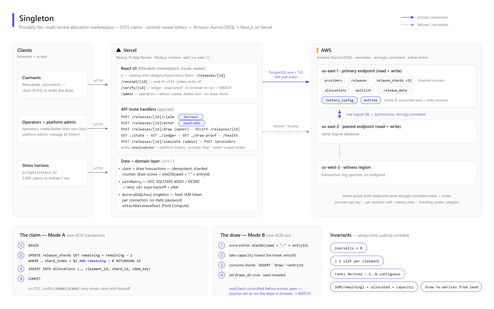

# Singleton — The Intel Document

**The complete A-to-Z technical intelligence on Singleton: what it is, why every piece exists, how each feature works, and how it was all proven.**

> Audience: anyone who needs the full picture — judges, reviewers, future contributors, or the author six months from now. The [README](../README.md) is the tour; this is the territory. Every claim here is grounded in the actual source (linked throughout) or in verified live runs against the production Aurora DSQL cluster.

| | |
|---|---|
| Live stack | Amazon Aurora DSQL (us-east-1) · Next.js 15 · Vercel (target) |
| Repository | https://github.com/Danishlynx/Singleton |
| Status | All gates green: 43 unit · 12 integration · 5 E2E · both stress modes proven live |
| Document version | June 2026, covers Mode A (FCFS) + Mode B (commit-reveal lottery) |

## Table of contents

1. [Executive summary](#1-executive-summary)
2. [The problem and the product](#2-the-problem-and-the-product)
3. [Architecture at a glance](#3-architecture-at-a-glance)
4. [Aurora DSQL — the platform and its real rules](#4-aurora-dsql--the-platform-and-its-real-rules)
5. [Data model — every table, every index, every constraint](#5-data-model--every-table-every-index-every-constraint)
6. [Mode A — first-come-first-served claims (the heart)](#6-mode-a--first-come-first-served-claims-the-heart)
7. [Mode B — windowed lottery with a commit-reveal draw](#7-mode-b--windowed-lottery-with-a-commit-reveal-draw)
8. [API reference — every endpoint](#8-api-reference--every-endpoint)
9. [Frontend — pages, components, and the design ethos](#9-frontend--pages-components-and-the-design-ethos)
10. [Platform layer — connections, auth, resilience, deployment](#10-platform-layer--connections-auth-resilience-deployment)
11. [Testing, verification, and operations](#11-testing-verification-and-operations)
12. [Security, privacy, and the adversarial reviews](#12-security-privacy-and-the-adversarial-reviews)
13. [Live verification results](#13-live-verification-results)
14. [Build journey and decision log](#14-build-journey-and-decision-log)
15. [Multi-tenancy, the marketplace, and operator UX](#15-multi-tenancy-the-marketplace-and-operator-ux)
16. [Glossary](#16-glossary)

---

## 1. Executive summary

Singleton allocates a **fixed batch of scarce slots** (clinic appointments, ticket drops, limited releases) to a large concurrent crowd with three guarantees that are usually bought with heavy infrastructure or a blockchain:

- **Correct** — the batch can never oversell, no matter how many requests arrive simultaneously;
- **Fair** — either strict first-come order (Mode A) or equal odds for everyone in an entry window (Mode B), with no line-jumping and at most one slot per person;
- **Verifiable** — every participant gets a receipt whose position can be independently re-checked against a public ledger, and a lottery's entire winner set can be **recomputed in the visitor's own browser**.

The defensible insight: **Amazon Aurora DSQL is strongly consistent, horizontally scalable, active-active multi-region, and serverless at once** — so each guarantee reduces to one ordinary ACID transaction (a sharded conditional decrement with optimistic-concurrency retry, or a single commit-reveal draw transaction). There is no Redis lock, no queue, no eventual-consistency reconciliation job, and no chain.

None of this is asserted on faith. The repository carries a stress harness that fired **10,000 concurrent claims at a 200-slot release on the live cluster and proved zero oversells with contiguous ranks 1..200**, and **5,000 concurrent lottery entries whose 200 drawn winners re-derive byte-for-byte from the revealed seed**. Three multi-agent adversarial review passes hunted the concurrency-, secrecy-, and authorization-critical code and the twelve real bugs they found are fixed and documented (§12). The app is multi-tenant (per-operator ownership, §15) and live on Vercel at **`https://singleton-six.vercel.app`**.

## 2. The problem and the product

### 2.1 The problem

When demand exceeds supply and allocation happens online, three failure modes repeat everywhere:

1. **Oversell.** Race conditions under load grant more slots than exist — double-booked vaccine appointments, oversold event tickets. The root cause is almost always read-then-write logic on infrastructure that cannot make that atomic at scale.
2. **Speed inequality.** First-come-first-served on the open internet is a latency auction: a datacenter bot beats a human on hospital wifi every time. "First come" silently becomes "best connected."
3. **Unverifiable fairness.** Even when allocation is honest, participants cannot check it. "You didn't get a slot" is indistinguishable from "we gave your slot to someone we liked."

### 2.2 The product answer

Singleton is allocation infrastructure a provider points a crowd at:

- A **release** is a published batch: title, capacity, open time, and a mode.
- **Mode A (FCFS)** keeps arrival order as the fairness rule but makes it *correct* (atomic, idempotent, oversell-impossible) and *auditable* (derived ranks on a public ledger). Right when arrival order genuinely matters.
- **Mode B (windowed lottery)** removes speed from the game entirely: everyone entering during the window is an equal entrant — second 1 and second 599 are identical. Winners are drawn by a **commit-reveal** scheme: the draw seed's hash is published *before* entries open, the seed is revealed after the draw, and anyone can re-run the selection in their browser and see **MATCH**. The intake page says the quiet part out loud: *"Entering early gives no advantage."* That sentence is the product.
- Every participant outcome is honest: a verifiable receipt, a fair waitlist, or a kind "not selected" with a link to the proof. No countdown-pressure dark patterns anywhere.

### 2.3 Who pays (the B2B story)

The customer is the **provider** — clinics releasing appointment blocks, ticketing operators, retail-drop brands — paying per release or per seat for allocation they can defend publicly: "verify it yourself" is a stronger customer-service answer than "trust us." Out of scope by design (§16 of the original spec): payments, full end-user accounts, production bot defense (clean hooks left where it attaches), notifications.

## 3. Architecture at a glance



*(Editable source: [architecture.svg](architecture.svg); regenerate the PNG with `node scripts/render-architecture.mjs docs/architecture.svg docs/architecture.png 2`.)*

**Request lifecycle in one paragraph.** A browser hits a Next.js 15 App Router page or `app/api/**` route handler on Vercel (Node.js runtime, region `iad1`, colocated with the cluster). DB code goes through a module-scope `AuroraDSQLPool` singleton — the official AWS connector for node-postgres — which mints a fresh IAM auth token per physical connection (no database password exists anywhere). Transactions run with explicit `BEGIN/COMMIT` against Aurora DSQL under snapshot isolation; commit-time optimistic-concurrency conflicts surface as SQLSTATE `40001` and are retried whole with backoff. Reads that drive live UI (remaining count, entrant count) are plain strongly-consistent `SELECT`s polled every 1.5 s — every viewer sees the same truth, proven by a cross-tab E2E test.

**The stack, with pins and reasons:**

| Layer | Choice | Why |
|---|---|---|
| Database | **Amazon Aurora DSQL** (single-region us-east-1; multi-region peering designed and scripted) | the only managed SQL that is strongly consistent + active-active + serverless at once — see §4 |
| DB driver | `@aws/aurora-dsql-node-postgres-connector` **0.1.9 (pinned)** + `pg` | official AWS connector; IAM token per connection, recycles before DSQL's 60-min cap; pinned because pre-1.0 |
| Data access | raw parameterized SQL via a thin typed `query<T>()` layer — **no ORM** | DSQL has no FKs/sequences and async DDL; ORMs fight it; the concurrency-critical SQL stays explicit and reviewable |
| Framework | **Next.js 15.5.19 (pinned)**, App Router, Node runtime only | spec-locked and research-verified (async `params`, GET uncached by default); `create-next-app` now ships 16, deliberately downgraded |
| UI | React 19 · Tailwind v4 · shadcn/ui (Radix) · lucide-react · sonner | one calm design system; two surfaces scaffolded with **v0** (§9) |
| Validation | Zod 4 | every API body and `process.env` |
| Tests | Vitest · Playwright · `scripts/stress.ts` | §11 |
| IDs | app-generated `crypto.randomUUID()` | DSQL has no sequences; random keys also spread write load; the app knows ids before insert |

**Repository layout:**

```
app/                  # routes: pages + app/api/** handlers (Next.js App Router)
src/db/               # pool, typed query + failover, retry, data access, lottery, migrate helpers
src/domain/           # claim (Mode A heart), draw (Mode B heart), lottery hashing, shards, rank
src/components/       # intake clients, lottery proof, admin, site chrome, v0/ surfaces
src/lib/              # admin auth, browser sha256, cn()
db/migrations/        # 0001 init · 0002 indexes · 0003 lottery · 0004 lottery indexes
                      #   · 0005 release_meta · 0006 provider_keys · 0007 release_category
scripts/              # migrate · seed · stress (both modes) · render-architecture · provision/*
tests/                # unit · integration (live DSQL) · e2e (Playwright)
docs/                 # this document, architecture diagram, submission checklist, v0 evidence
```

## 4. Aurora DSQL — the platform and its real rules

Aurora DSQL is AWS's serverless, distributed SQL database: PostgreSQL wire protocol, **no instances or capacity planning, pay-per-request**, strong consistency everywhere, and (when peered) active-active writes in two regions arbitrated by a witness region. For an allocation system this combination is the whole ballgame: strong consistency makes the conditional decrement trustworthy, serverless makes a thundering herd an economics problem instead of a capacity-planning problem, and active-active multi-region means both endpoints accept writes to one logical database.

DSQL is **not** full PostgreSQL, and the differences shaped most files in this repository. Every rule below was verified against the current AWS Aurora DSQL User Guide during a research pass with adversarial fact-checking (June 2026) — several contradict community folklore:

| Rule (verified) | Consequence in this codebase |
|---|---|
| **CHECK constraints ARE supported** — preview-era folklore says otherwise | `capacity > 0`, `remaining >= 0`, status enums stay DB-enforced ([0001_init.sql](../db/migrations/0001_init.sql)) |
| **No FOREIGN KEY / REFERENCES** — the real removal | relationships app-enforced; unique indexes used where they help |
| No sequences / `SERIAL`; `gen_random_uuid()` exists built-in | app-generated UUIDs via `crypto.randomUUID()` everywhere |
| No triggers, PL/pgSQL, or extensions (no pgcrypto) | **all hashing in app code** — the commit-reveal scheme is implemented in Node + WebCrypto, never SQL |
| DDL is async; `CREATE INDEX ASYNC` returns before the index is usable | the migration runner polls `pg_index.indisvalid` to completion ([scripts/migrate.ts](../scripts/migrate.ts)) |
| One DDL per transaction; **DDL and DML cannot share a transaction** | every migration statement runs in its own transaction |
| Optimistic concurrency control, isolation fixed at REPEATABLE READ; conflicts at COMMIT as SQLSTATE `40001` (`OC000` data / `OC001` schema) | the `withRetry` discipline around every contended transaction (§6, §10) |
| **Hot single-row updates collapse under OCC** | the sharded counter (§5.4) — the single most load-bearing design decision |
| Per-transaction caps: **3,000 rows modified · 10 MiB · 5 minutes** (row cap is index-count-independent) | claim writes 2 rows; the full 200-winner draw writes ~234; seeds chunk trivially |
| Connections force-closed at **60 minutes**; IAM auth tokens default to **15-minute TTL** and authenticate only the handshake | the connector mints a token per connection and recycles; no token caching anywhere |
| 1 database (`postgres`) per cluster; ~100 new connections/sec rate | pooled connections reused aggressively under stress |

Two corrections the research pass made to the original build spec are worth naming because they would have cost real time: the *"DSQL drops CHECK constraints"* belief is false (kept DB-enforced invariants), and the official node-postgres connector **does** exist as a real npm package (`@aws/aurora-dsql-node-postgres-connector`, GA Nov 2025) — the older "hand-roll tokens with `@aws-sdk/dsql-signer`" guidance is now the fallback path, retained in this repo only as a documented alternative.

---

## 5. Data model — every table, every index, every constraint

The schema is seven additive SQL files totalling well under 200 lines, applied by a custom runner that exists because Aurora DSQL's DDL rules make off-the-shelf migration tools (which wrap files in multi-statement transactions) unusable. Six tables serve FCFS mode plus bookkeeping; two more serve the lottery; the later migrations add branding/category to a side table and an operator key to `providers` — **all strictly additive, never altering an existing column's meaning** (see §15 for the multi-tenancy and marketplace features they enable). Every constraint that DSQL *can* enforce is pushed into the database; everything it cannot (foreign keys, sequences, triggers) is replaced by an explicit application-layer mechanism described below.

### 5.1 Table inventory

| Table | Created in | Role | Key invariant it anchors |
|---|---|---|---|
| `schema_migrations` | bootstrapped by [scripts/migrate.ts](../scripts/migrate.ts) | which migration files have run | idempotent re-runs |
| `providers` | [0001](../db/migrations/0001_init.sql) (+ `api_key` in [0006](../db/migrations/0006_provider_keys.sql)) | operators/tenants; `api_key` authenticates them | unique `api_key` (operator identity) |
| `releases` | [0001](../db/migrations/0001_init.sql) | a drop: capacity, window, status | `capacity > 0`, status state machine |
| `release_shards` | [0001](../db/migrations/0001_init.sql) | capacity split into N counter rows | `SUM(remaining)` = remaining capacity; `remaining >= 0` |
| `allocations` | [0001](../db/migrations/0001_init.sql) | one row per granted slot | no oversell, one slot per claimant, retry safety |
| `waitlist` | [0001](../db/migrations/0001_init.sql) | claimants who arrived after sell-out | one entry per claimant |
| `lottery_config` | [0003](../db/migrations/0003_lottery.sql) | per-release commit-reveal state | seed committed before entries open; draw runs once |
| `entries` | [0003](../db/migrations/0003_lottery.sql) | one row per lottery entrant | one entry per claimant |
| `release_meta` | [0005](../db/migrations/0005_release_meta.sql) (+ `category` in [0007](../db/migrations/0007_release_category.sql)) | optional branding: poster, description, venue, event date, category | 1:1 with a release (app-enforced) |

### 5.2 Core tables

**`providers`** — `id uuid PK`, `name`, `created_at`, and (since [0006](../db/migrations/0006_provider_keys.sql)) a nullable, unique **`api_key`**. Originally a minimal owner record; the key turned it into the tenant identity for the multi-tenancy model (§15). Existing/seed providers have a `NULL` key (NULLs are distinct in a Postgres unique index, so many coexist) and are platform-owned demo data; an operator who self-registers through `/api/providers` gets a real `op_…` key that authenticates them as a tenant.

**`releases`** — the central entity:

```sql
CREATE TABLE IF NOT EXISTS releases (
  id          uuid PRIMARY KEY,
  provider_id uuid NOT NULL,                            -- app-enforced -> providers.id
  title       text NOT NULL,
  capacity    integer NOT NULL CHECK (capacity > 0),
  shard_count integer NOT NULL CHECK (shard_count > 0), -- e.g. 32
  opens_at    timestamptz NOT NULL,
  status      text NOT NULL DEFAULT 'scheduled'
              CHECK (status IN ('scheduled', 'open', 'closed')),
  ...
```

`capacity` is the *immutable promise* — the number the no-oversell invariant is measured against. It is never decremented; the live count lives in `release_shards`, so `capacity` remains the audit baseline (`SUM(shards.remaining)` at creation must equal it, and `COUNT(allocations)` may never exceed it). `shard_count` is stored per release rather than as a global constant so a release's shard layout is self-describing and a future release could tune it without a redeploy. `status` is a CHECK-constrained three-state machine; transitions are app-driven, but the database rejects any state outside the enum.

**`release_shards`** — the sharded counter. One row per `(release_id, shard_index)` holding `remaining integer NOT NULL CHECK (remaining >= 0)`. That CHECK is the **last line of defense against oversell**: even if every application-level guard were deleted, a decrement that would take a shard negative fails at the database. Why a *set* of counter rows instead of one — see §5.4.

**`allocations`** — one row per granted slot:

| Column | Why it exists |
|---|---|
| `id uuid PK` | app-generated (`crypto.randomUUID()`), so the claim path knows the allocation id *before* insert — it can build the receipt and tie it to the idempotency key up front |
| `release_id` | scoping for both unique indexes and rank derivation |
| `claimant_id text` | email or stable session id; `text` rather than a user FK because there is no accounts table — identity is whatever the verifier presents |
| `shard_id` | which counter row paid for this slot; lets an audit prove `COUNT(allocations per shard) + remaining = initial shard capacity` |
| `idempotency_key` | retry safety (see `uq_alloc_idem` in §5.5) |
| `claimed_at timestamptz DEFAULT now()` | the ordering key for derived ranks |

Note what `allocations` does **not** have: a `rank` column. Rank is *derived* at read time from `ORDER BY claimed_at, id` (backed by `idx_alloc_release_order`). Storing rank would require either a sequence (DSQL has none) or a serialized "next rank" counter — exactly the hot-row pattern the shards exist to avoid. Deriving it costs one ordered scan and can never produce gaps or duplicates; the live stress run (3,000 concurrent claims against capacity 200) yielded derived ranks exactly 1..200, contiguous.

**`waitlist`** — `id`, `release_id`, `claimant_id`, `joined_at`. The consolation path once shards hit zero. Same shape as allocations minus shard/idempotency machinery, with its own one-per-claimant unique index.

**`schema_migrations`** — `filename text PRIMARY KEY, applied_at`. Intentionally *not* in any migration file: [scripts/migrate.ts](../scripts/migrate.ts) bootstraps it with `CREATE TABLE IF NOT EXISTS` before reading the migrations directory, which breaks the chicken-and-egg problem without a special "migration zero".

### 5.3 Lottery tables (additive only)

[0003_lottery.sql](../db/migrations/0003_lottery.sql) alters nothing. A release is in lottery mode **iff** a `lottery_config` row exists for it — mode is encoded by row existence, not a flag on `releases`, so FCFS behavior could not regress when the lottery shipped. (The adversarial review still found a seam here: `/claim` had to explicitly reject lottery releases, since nothing in the schema stops an allocation row for one.)

**`lottery_config`**:

```sql
CREATE TABLE IF NOT EXISTS lottery_config (
  release_id      uuid PRIMARY KEY,      -- 1:1 with releases.id (app-enforced)
  entry_closes_at timestamptz NOT NULL,  -- window close = draw time
  seed_hash       text NOT NULL,         -- sha256 of the seed; public from creation
  seed            text NOT NULL,         -- 64-char hex; NEVER exposed until drawn_at set
  drawn_at        timestamptz            -- NULL until the draw has run
);
```

- `release_id` as the **primary key** is what makes the 1:1 relationship structural — a second config row for the same release is impossible.
- `seed_hash` / `seed` are the two halves of the commit-reveal: the hash is public from the moment the release is created (the commitment), the seed stays secret until the draw (the reveal). A schema comment flags the trade-off honestly: production would keep the unrevealed seed in a secrets manager; on-row storage is accepted for this build, with a hard rule that the seed never appears in logs or error messages.
- `drawn_at` is the **draw-once guard**: the draw flips it from NULL atomically, so a concurrent or repeated draw observes it set and becomes a no-op. Verified live: a repeat draw against the cluster changed nothing, and the winner set re-derived byte-for-byte from `seed` + the entry list.

**`entries`** — `id uuid PK` (public in draw proofs), `release_id`, `claimant_id` (**never** public — it may be an email; an early version of the ledger API leaked it, found and fixed in review), `entered_at`. The privacy split between `id` and `claimant_id` is the reason both columns exist: proofs reference entries by opaque UUID so anyone can verify the draw without learning who entered.

### 5.4 The sharded counter — why one hot row dies under OCC

Aurora DSQL uses optimistic concurrency control: transactions never block each other; conflicting writes to the same key are detected at commit and one side aborts with a serialization error (the documented guidance is to avoid frequent single-row updates). A single `remaining` counter for a hyped drop is the pathological case — N concurrent claimants all write the same row, so at most one commit per "round" survives and the rest retry, repeatedly. Throughput collapses to roughly serial while retry traffic grows with N.

The fix is to make the counter 32 rows instead of one. [src/domain/shards.ts](../src/domain/shards.ts) provides the two pure helpers:

```ts
const base = Math.floor(capacity / shardCount);
let remainder = capacity % shardCount;
// e.g. distributeCapacity(200, 32) -> 8 shards of 7 + 24 shards of 6 (= 200)
```

The remainder goes to the *first* shards, so the array always sums exactly to `capacity` — that sum is the no-oversell budget, so it must be exact, not approximate. The second helper, `shuffle` (Fisher–Yates with an injectable RNG for deterministic tests), is the other half of the design: each claimant visits the shards in a **random order**, decrementing the first one with `remaining > 0`. Without the shuffle everyone would pile onto shard 0 and recreate the hot-row problem; with it, expected contention per row drops by ~32×. Conflicts still happen — they are expected and handled by retry (a warm-up run of 500 attempts saw 67 OCC retries, all successful) — sharding just keeps them rare enough that retries converge. The live result: 3,000 concurrent claims, exactly 200 allocations, zero oversells.

Both helpers are dependency-free on purpose: the arithmetic that the oversell invariant rests on is unit-tested without a database in the loop.

### 5.5 Every index, and the exact behavior it enforces

All indexes are created with `CREATE INDEX ASYNC` in [0002](../db/migrations/0002_indexes.sql) and [0004](../db/migrations/0004_lottery_indexes.sql) — DSQL's only index-creation mode (see §5.7 for what the runner does about it).

| Index | Definition | What it enforces / serves |
|---|---|---|
| `uq_alloc_release_claimant` | UNIQUE `allocations(release_id, claimant_id)` | **One slot per person per release.** Two racing claims by the same claimant cannot both insert; this is what made all 200 stress-test winners distinct. Also makes a duplicate claim detectable as "you already have one" rather than an error. |
| `uq_alloc_idem` | UNIQUE `allocations(idempotency_key)` | **Retry safety.** A client that times out and resends with the same key can never mint a second allocation. Note the index alone is necessary but not sufficient: review found that returning the existing row on key collision without checking ownership let an attacker replay someone else's key and read their receipt — the app now verifies the claimant matches before returning it. |
| `idx_alloc_release_order` | `allocations(release_id, claimed_at, id)` | **Derived ranks.** Backs the `ORDER BY claimed_at, id` scan; `id` is the deterministic tie-break when two rows share a timestamp, so rank assignment is stable across reads. Non-unique by design — ordering, not exclusion. |
| `uq_shards_release_idx` | UNIQUE `release_shards(release_id, shard_index)` | A re-run or buggy seeder cannot create a duplicate shard row, which would silently inflate `SUM(remaining)` and break the capacity budget. |
| `uq_waitlist_release_claimant` | UNIQUE `waitlist(release_id, claimant_id)` | One waitlist entry per person; makes joining idempotent. |
| `uq_entries_release_claimant` | UNIQUE `entries(release_id, claimant_id)` | **One lottery entry per person** — the fairness floor of the draw. Held under load: 3,000 concurrent entries, 3,000 rows, zero duplicates. |
| `idx_entries_release` | `entries(release_id)` | Live entrant count and the full entry list the draw and its verifier iterate. |
| `idx_releases_provider`, `idx_shards_release` | plain lookups | Provider's releases; a release's shard set (the claim path loads all 32 rows to shuffle). |

The pattern worth naming: every uniqueness rule in the system is a **database** index, not an application check. App-level "SELECT then INSERT" checks race under concurrency; a unique index turns the race into a constraint violation one side receives and handles deterministically.

### 5.6 What is deliberately absent — and what replaces it

DSQL does not support foreign keys, sequences (`SERIAL`/`IDENTITY`), or triggers. The schema treats each as a design input rather than a limitation to paper over:

| Missing feature | Replacement | Where |
|---|---|---|
| Foreign keys | App-enforced references, annotated in-schema (`-- app-enforced -> releases.id`); writes go through domain functions that resolve the parent first | every `*_id` column in [0001](../db/migrations/0001_init.sql), [0003](../db/migrations/0003_lottery.sql) |
| Sequences / auto-increment | App-generated UUID PKs via `crypto.randomUUID()` | all tables |
| Triggers | Nothing to replace — no derived columns exist; rank is computed at read time | §5.2 |

Two nuances. First, the practical risk of missing FKs is orphaned children (an allocation pointing at a deleted release), not corrupted invariants — nothing in this system deletes parents, so the exposure is theoretical here. Second, app-generated UUIDs are not merely a workaround: the schema notes that `DEFAULT gen_random_uuid()` *is* available on DSQL (built in, no extension), but generating ids client-side lets the claim path know the allocation id before the insert, which the idempotency and receipt flow depends on.

### 5.7 CHECK constraints ARE used — DSQL supports them

A common misreading of "DSQL has limited DDL" is to assume CHECK constraints are out. They are not — column- and table-level CHECKs are supported (verified against the DSQL create-table syntax docs, noted in the [0001](../db/migrations/0001_init.sql) header), and the schema leans on them as real DB-enforced invariants: `capacity > 0`, `shard_count > 0`, `status IN ('scheduled','open','closed')`, and the critical `remaining >= 0`. The principle: any invariant the database can hold should live in the database, because application code gets refactored and reviewed by humans; a CHECK does not.

### 5.8 The migration runner — honoring DSQL's DDL rules

DSQL imposes three rules that break conventional migration tooling: **one DDL statement per transaction**, **no mixing DDL and DML in a transaction**, and **asynchronous index builds**. [scripts/migrate.ts](../scripts/migrate.ts) plus the pure helpers in [src/db/migrate-helpers.ts](../src/db/migrate-helpers.ts) handle each explicitly:

1. **One statement, one transaction.** `splitSqlStatements` strips `--` comments and splits each file on `;`; every resulting statement is issued as its own auto-committed `pool.query`. (The naive split is documented as safe because the migrations contain no `;` inside string literals and no dollar-quoted bodies — DSQL has no PL/pgSQL, so none can exist.) The runner never opens a wrapping transaction, which is precisely what Flyway-style tools do and why they fail here.
2. **No DDL+DML mixing.** The `INSERT INTO schema_migrations` recording a file runs as its own statement, after all of the file's DDL — never in the same transaction.
3. **`CREATE INDEX ASYNC` + validity polling.** Async creation returns immediately while a background job builds the index; until `pg_index.indisvalid` is true the index is not enforceable. After issuing each async statement, the runner parses the index name and polls:

   ```ts
   if (isAsyncIndexStatement(stmt)) {
     const name = parseAsyncIndexName(stmt);
     await waitForIndexValid((s, p) => query(s, p, noFailover), name);
   }
   ```

   `waitForIndexValid` polls `pg_index.indisvalid` (1s interval, 120s timeout, both injectable for tests). This wait is **correctness, not politeness**: if the runner recorded a migration while `uq_alloc_release_claimant` was still building, the app could serve claims with the one-slot-per-person rule unenforced. The failure mode is also handled — a failed unique build leaves an *INVALID* index that still rejects duplicate DML, so the timeout error explicitly tells the operator to `DROP INDEX <name>` and retry rather than letting a half-broken index linger silently.
4. **Idempotent re-runs.** Applied filenames are skipped via `schema_migrations`; and because every statement in every file uses `IF NOT EXISTS`, a run that crashed mid-file (before the filename was recorded) re-executes safely from the top.
5. **Determinism.** All runner queries pass `{ failover: false }` and target the primary endpoint only — a peered multi-region pair is one logical database, so migrating once suffices, and disabling failover ensures a flaky run fails loudly instead of half-applying through a region switch.

---

## 6. Mode A — first-come-first-served claims (the heart)

Everything in Mode A funnels through one function: `claim(releaseId, claimantId, idempotencyKey)` in [src/domain/claim.ts](../src/domain/claim.ts). It is the only code path that decrements stock for an FCFS release, and it is the part of the system the stress harness attacks hardest: 3,000 concurrent claims against capacity 200 across 32 shards on the live us-east-1 cluster produced exactly 200 allocations, zero oversells, all claimants distinct, and derived ranks 1..200 with no gaps.

The walkthrough below follows the code top to bottom. Two gates run before the algorithm proper: the release must exist, and it must actually be an FCFS release — a `lottery_config` row hard-fails the claim with `ClaimError("lottery_mode")`. That guard exists because an adversarial review pass found that without it, anyone could bypass the lottery's fairness window by calling `/claim` directly during entry. A release that is `scheduled`, `closed`, or not yet past `opens_at` returns `not_open` without touching stock.

### 6.1 Step 0 — idempotent short-circuit

```ts
const existing = await findAllocationByClaimant(releaseId, claimantId);
if (existing) {
  return { status: "allocated", allocationId: existing.id, alreadyHeld: true };
}
```

If the claimant already holds a slot ([src/db/allocations.ts](../src/db/allocations.ts) `findAllocationByClaimant`), the claim returns it with `alreadyHeld: true` and performs no write. This makes retries from flaky clients free: a double-clicked button or a re-sent HTTP request costs one read. Note that this read is an optimization, not the correctness mechanism — two truly concurrent requests from the same claimant can both pass this check, and the `(release_id, claimant_id)` unique index resolves them later (step 3).

### 6.2 Step 1 — candidate-shard prefilter

```ts
// SPEC-NOTE: the spec walks ALL shard indexes blind; we first read which shards
// still have stock (one round trip) and walk only those, shuffled.
const candidates = await query<{ shard_index: number }>(
  "SELECT shard_index FROM release_shards WHERE release_id = $1 AND remaining > 0",
  [releaseId], connOpts,
);
```

One SELECT fetches the shard indexes that still had stock at snapshot time. This is purely a latency optimization, and the `SPEC-NOTE` in the code is explicit about the deviation: the original spec probes all `shard_count` shards blind, which means a sold-out claim costs O(shard_count) transactions. The prefilter turns that into a single read.

The critical property is that this read can be stale and that is fine. Under concurrency, a shard reported as `remaining > 0` may be drained before this claimant reaches it; a shard reported empty may have been replenished (it cannot be in this system, but the argument does not depend on that). Correctness rests *solely* on the conditional UPDATE inside the per-shard transaction (step 3). The prefilter only decides which shards are worth visiting. If the prefilter returns no rows, the claim is sold out from this snapshot's perspective — and because shards are never incremented, "empty in any snapshot" is permanently true, so the sold-out exit is safe without re-verification.

### 6.3 Step 2 — shuffled shard order

The candidate list is shuffled with a Fisher–Yates shuffle ([src/domain/shards.ts](../src/domain/shards.ts), RNG injectable for deterministic tests) before probing. Capacity is sharded in the first place because Aurora DSQL's optimistic concurrency control makes a hot single-row counter pathological: every concurrent decrement of the same row conflicts at commit, so throughput collapses into a retry storm. `distributeCapacity(200, 32)` splits stock into 32 rows (8 of 7 + 24 of 6), and randomizing the visit order spreads concurrent claimants across those rows.

If everyone walked shards in index order instead, all concurrent claimants would pile onto shard 0, conflict, retry, pile onto shard 0 again — recreating the single-row hotspot the sharding was meant to remove. With random order, two simultaneous claimants collide on the same shard with probability ≈ 1/candidates, and a collision costs one retry, not livelock. The warm-up stress run quantifies the residual contention: 67 OCC retries across 500 attempts, all of which subsequently succeeded.

### 6.4 Step 3 — the per-shard transaction

Each shard probe is one short transaction on a dedicated connection ([src/domain/claim.ts](../src/domain/claim.ts)):

```ts
await client.query("BEGIN");
const upd = await client.query<{ id: string }>(
  `UPDATE release_shards
      SET remaining = remaining - 1
    WHERE release_id = $1 AND shard_index = $2 AND remaining > 0
    RETURNING id`,
  [releaseId, shardIndex],
);
if (upd.rowCount === 0) { await client.query("COMMIT"); return { kind: "empty" }; }
await client.query(
  `INSERT INTO allocations (id, release_id, claimant_id, shard_id, idempotency_key)
   VALUES ($1, $2, $3, $4, $5)`,
  [allocationId, releaseId, claimantId, upd.rows[0].id, idempotencyKey],
);
await client.query("COMMIT");
```

The `WHERE … remaining > 0` clause is the no-oversell mechanism: the decrement and the emptiness check are one atomic statement, and the INSERT rides in the same transaction, so a committed decrement always pairs with exactly one allocation row. Every failure mode has a deliberate exit:

| Outcome | Signal | Exit |
|---|---|---|
| Shard drained since prefilter | `rowCount === 0` | COMMIT (nothing changed), return `empty`, try next shard |
| Claimant already holds a slot, or idempotency key replayed | SQLSTATE `23505` on the INSERT | ROLLBACK (decrement undone — no oversell), return `duplicate`, resolve idempotently below |
| Commit-time OCC conflict (two transactions decremented the same shard) | SQLSTATE `40001` | ROLLBACK, rethrow — bubbles out of `withConnection` to `withRetry`, which retries the *whole* claim including a fresh prefilter |
| Anything else (network, constraint, bug) | other error | ROLLBACK, propagate to the caller untouched |

The `duplicate` resolution deserves attention because the naive version was an exploit. There are two unique indexes that can raise `23505`: `(release_id, claimant_id)` and the *global* `idempotency_key` index. The first lookup, `findAllocationByClaimant`, covers the common case (the same claimant raced itself). But if that misses, the violation came from the idempotency key — and a different claimant may have replayed someone else's key. The first adversarial review pass found that returning `findAllocationByIdempotencyKey(key)` unconditionally let an attacker who guessed or sniffed a key receive the victim's allocation receipt. The fix is the ownership check:

```ts
const byKey = await findAllocationByIdempotencyKey(idempotencyKey);
if (byKey && byKey.claimant_id === claimantId) {
  return { allocationId: byKey.id, alreadyHeld: true };
}
throw new ClaimError("duplicate_unresolved", ...);
```

A key collision across claimants now fails loudly instead of leaking a receipt.

### 6.5 Step 4 — `withRetry` semantics

[src/db/retry.ts](../src/db/retry.ts) wraps the entire shard-walking closure, not the individual transaction, so each retry re-runs the prefilter and re-shuffles — a retried claim never beats its head against the same stale shard list.

The policy is narrow by design: `isOccConflict` matches SQLSTATE `40001` plus Aurora DSQL's message codes (`OC000` data conflict, `OC001` schema conflict) and the standard serialization-failure phrasings, and `withRetry` retries *only* those. Aurora DSQL runs snapshot isolation with conflicts detected at COMMIT, so a `40001` means "your snapshot lost a race; the world is fine; try again" — the one error class where blind re-execution is provably safe. Everything else (constraint violations, connection failures, application bugs) propagates immediately, because retrying those would either mask a real failure or duplicate a side effect.

Backoff is capped exponential (base 5 ms, cap 250 ms) with full jitter — the delay is uniform in `[0, exp]` rather than exactly `exp`, which de-correlates a cohort of claimants that all conflicted at the same instant; deterministic backoff would have them re-collide in lockstep. Attempts cap at 8 (overridable via `ClaimOptions.maxAttempts`), and `sleep`, `rng`, and `onRetry` are injectable, which is how the unit tests verify the policy without wall-clock time and how the stress harness counts retries.

### 6.6 Step 5 — sold out → idempotent waitlist

When the prefilter returns nothing or every candidate shard probes `empty`, the closure returns `null` and the claimant is added to the waitlist via `INSERT … ON CONFLICT DO NOTHING` on the `(release_id, claimant_id)` unique index ([src/db/allocations.ts](../src/db/allocations.ts) `addToWaitlist`). Re-claiming after sell-out is therefore a no-op rather than a duplicate waitlist row, and the response is always `{ status: "sold_out", waitlisted: true }`.

### 6.7 The four invariants, and why they hold under OCC

The doc-comment on `claim()` states four invariants. Each is enforced by the database, not by application discipline — the app code could be rewritten badly and the worst outcome would be errors, not oversell.

**(a) `remaining ≥ 0`, always.** Two mechanisms, and the distinction matters. The schema's CHECK constraint (`remaining >= 0`) is the backstop, but **a CHECK constraint alone cannot prevent concurrent oversell under snapshot isolation**: two transactions each read `remaining = 1` from their own snapshots, each compute `1 − 1 = 0`, each pass the CHECK against their local view, and under a naive engine both would commit — leaving `remaining = −1` or, with the constraint, an unpredictable late failure. What actually closes the race is the combination of the conditional `WHERE remaining > 0` (the check and the write are atomic within one statement) and DSQL's commit-time conflict detection: when two transactions write the same shard row, at most one commits; the other receives `40001`, rolls back its decrement *and* its allocation insert together, and retries against a fresh snapshot in which `remaining` is now 0 — where the conditional UPDATE matches no row.

**(b) ≤ 1 slot per claimant.** Enforced by the unique index on `(release_id, claimant_id)`. The step-0 read is racy, but two concurrent claims by the same claimant resolve at the INSERT: one commits, the other gets `23505`, its decrement rolls back atomically, and the duplicate handler returns the winner's allocation. The stress run's "all claimants distinct" assertion exercises exactly this.

**(c) total allocations ≤ capacity.** Follows compositionally from (a): shard remainders start summing to `capacity` (`distributeCapacity` provably sums to it), every committed allocation insert is transaction-paired with exactly one committed decrement, and no path increments `remaining`. So `count(allocations) = capacity − Σ remaining ≤ capacity`, with equality at sell-out — which is why [src/db/releases.ts](../src/db/releases.ts) `getReleaseState` can derive `allocated = capacity − remaining` instead of counting.

**(d) stable first-come order.** `claimed_at` is assigned by the database at insert, and the total order `(claimed_at, id)` is deterministic: the UUID tiebreak makes simultaneous-timestamp rows ordered, and committed rows are immutable (allocations are never updated), so every reader derives the identical sequence. "First-come" here means commit order at the granularity of the timestamp — two claims that commit in the same instant are ordered by id, which is fair in the sense of being unmanipulable (ids are `randomUUID()`).

### 6.8 Rank is derived, never stored

A stored rank column would itself be a hot, contended counter — assigning "you are #137" at insert time would require serializing all inserts, undoing the entire sharding design. Instead the rank is a pure function of the ledger, computed on read ([src/db/allocations.ts](../src/db/allocations.ts) `getAllocationWithRank`):

```sql
(1 + (
  SELECT count(*) FROM allocations a2
   WHERE a2.release_id = a.release_id
     AND (a2.claimed_at < a.claimed_at
          OR (a2.claimed_at = a.claimed_at AND a2.id < a.id))
))::int AS "rank"
```

The ordering is written as an explicit OR rather than a row-value tuple comparison for DSQL compatibility, and the ledger endpoint (`getLedger`) uses the matching `ORDER BY claimed_at, id` with rank assigned by array position — the same total order, so a receipt's rank always agrees with the public ledger.

The stress harness re-derives ranks independently in JavaScript ([src/domain/rank.ts](../src/domain/rank.ts)) and asserts they are exactly `{1..N}` via `checkContiguousRanks`. For that cross-check to be valid, the JS tiebreak must agree with Postgres's `uuid <` semantics, and it does for a non-obvious reason documented in the file: `crypto.randomUUID()` emits lowercase canonical UUIDs, whose lexicographic *string* order coincides with Postgres's uuid *byte* order — the dashes occupy identical positions in every canonical UUID, so they never influence a relative comparison, and lowercase hex digits sort identically as characters and as nibbles. If ids were mixed-case or non-canonical, `a.id < b.id` in JS and `a2.id < a.id` in SQL could disagree and the verification would produce false alarms; the live run confirmed parity with 200/200 contiguous ranks.

---

## 7. Mode B — windowed lottery with a commit-reveal draw

FCFS is honest but it rewards latency: whoever sits closest to us-east-1 with the fastest network wins, every time. For drops where that is unacceptable, Mode B replaces the race with a window — every entry submitted before `entry_closes_at` has exactly equal odds, regardless of whether it arrived in the first millisecond or the last. That sentence is the product. Everything else in this chapter exists to make it *provable* rather than merely promised.

### 7.1 The commit-reveal scheme

The operator could rig a naive lottery by picking the seed after seeing the entries. Commit-reveal removes that power:

1. **At release creation**, [src/domain/lottery.ts](../src/domain/lottery.ts) generates the seed and its commitment:

   ```ts
   export function generateSeed(): { seed: string; seedHash: string } {
     const seed = randomBytes(32).toString("hex");
     return { seed, seedHash: sha256Utf8Hex(seed) };
   }
   ```

   Only `seedHash` is published. The seed itself sits in the `lottery_config.seed` column ([db/migrations/0003_lottery.sql](../db/migrations/0003_lottery.sql)) and is never serialized into any API payload, log line, or error message until the draw has run — a SPEC-NOTE in the migration acknowledges that production would hold it in a secrets manager instead of on-row.

2. **During the window**, entrants can verify the operator is committed (the hash is fixed) but learn nothing about the seed.

3. **Strictly post-draw**, the seed is revealed. Anyone can check `sha256(seed) === seedHash` and recompute the entire winner set.

The operator cannot change the seed after seeing entries (the hash would no longer match), and entrants cannot grind favorable entry IDs (the seed is unknown when they enter). Fairness requires no trust in the server — only in SHA-256.

### 7.2 The locked hash formats — and why we hash strings, not bytes

Three formats are frozen, documented in the header of [src/domain/lottery.ts](../src/domain/lottery.ts):

| Quantity | Definition |
|---|---|
| `seed` | `randomBytes(32).toString('hex')` — 64 lowercase hex chars |
| `seedHash` | `sha256utf8(seed)` — SHA-256 of the UTF-8 bytes of the hex **string** |
| `score(e)` | `sha256utf8(`${seed}:${entryId}`)` — entryId is the canonical lowercase UUID |
| winners | sort entries by (`score` asc, `entryId` asc), take `capacity` |

The deliberate oddity is hashing the hex *string* rather than the raw 32 bytes. Raw bytes would be marginally "cleaner" cryptographically, but the verification story runs in a browser, where the seed arrives as a JSON string. Hashing the string means a verifier never has to hex-decode anything — `TextEncoder().encode(seed)` is the entire input pipeline, and there is no class of bugs around byte order, decoding case-sensitivity, or malformed hex. The same logic applies to `score`: concatenating two strings with `:` and hashing UTF-8 bytes is reproducible in any language in one line. The `entryId` tiebreak on equal scores makes the sort a total order, so two correct implementations cannot disagree even in the (practically impossible) event of a SHA-256 collision among scores.

DSQL has no `pgcrypto`, so all hashing is application code — which is also why the derivation lives in a pure function, [`deriveWinners`](../src/domain/lottery.ts), with no database access at all.

### 7.3 Server/browser parity

Two implementations exist and must agree byte-for-byte:

- **Server**: `sha256Utf8Hex` in [src/domain/lottery.ts](../src/domain/lottery.ts), via `node:crypto`'s `createHash`.
- **Browser**: `sha256Utf8HexBrowser` / `deriveWinnersBrowser` in [src/lib/sha256.ts](../src/lib/sha256.ts), via WebCrypto (`crypto.subtle.digest`), used by the public verify page to re-run the entire draw client-side.

Drift between them would silently break the public proof — the verify page would compute a different winner set than the server allocated. So the formats are pinned by a fixture in [tests/unit/lottery.test.ts](../tests/unit/lottery.test.ts): a seed, entry ID, expected `seedHash`, and expected `score` were generated once with `createHash` and hard-coded. Both implementations must reproduce the fixture exactly, plus agree on freshly generated random inputs. If anyone "refactors" the hash input format, two unit tests fail before any release is harmed. The live lottery stress run confirmed the property end-to-end: 3,000 entries, 200 winners, and the winner set re-derived byte-for-byte from the revealed seed and entry list.

### 7.4 Schema and mode resolution: strictly additive

Mode B touches zero Mode A tables. [db/migrations/0003_lottery.sql](../db/migrations/0003_lottery.sql) adds exactly two:

- `lottery_config` — 1:1 with `releases.id` (app-enforced; DSQL has no FKs), holding `entry_closes_at`, `seed_hash`, the secret `seed`, and the all-important `drawn_at timestamptz` (NULL until drawn).
- `entries` — `(id, release_id, claimant_id, entered_at)`, with a unique index on `(release_id, claimant_id)` added asynchronously in [db/migrations/0004_lottery_indexes.sql](../db/migrations/0004_lottery_indexes.sql) (DSQL's `CREATE UNIQUE INDEX ASYNC`).

A release *is* a lottery iff a `lottery_config` row exists — that single existence check is [`getMode`](../src/db/lottery.ts) in [src/db/lottery.ts](../src/db/lottery.ts). No `mode` column on `releases`, no enum migration, no risk of a half-migrated release. The data-access layer enforces the secrecy boundary in types: `getLotteryConfigInternal` is the only function that returns the seed (its interface comments mark the field `SECRET pre-draw`), while `getPublicLotteryState` returns only `entryClosesAt`, `seedHash`, and `drawnAt`.

Entry itself ([`insertEntry`](../src/db/lottery.ts)) is the easy half of Mode B: a random-UUID insert with the unique violation downgraded to "return the existing entry." Random-UUID inserts barely contend under OCC, so entries need none of Mode A's shard machinery — the live stress run recorded 3,000 concurrent entries with 0 errors and 0 duplicates.

### 7.5 The draw transaction, step by step

[`draw`](../src/domain/draw.ts) in [src/domain/draw.ts](../src/domain/draw.ts) is one atomic transaction, wrapped in `withRetry` so an OCC conflict (SQLSTATE 40001) replays the whole thing against a fresh snapshot. Before the transaction, a fast path re-checks `drawn_at` and returns an idempotent summary without writing anything. Inside `BEGIN`/`COMMIT` (one repeatable-read snapshot):

1. **Guards.** Re-read `lottery_config` *inside* the snapshot: if `drawn_at` is set, another draw won — `ROLLBACK` and return `already_drawn`. If `entry_closes_at` is still in the future, throw `window_open`. The pre-transaction checks alone would race; only the in-snapshot read is authoritative.
2. **Winner derivation.** Read all entries, then call the pure `deriveWinners(seed, entryIds, capacity)`. Nothing about winner selection touches the database — which is precisely what lets outsiders recompute it.
3. **Shard consumption planning.** [`planShardConsumption`](../src/domain/lottery.ts) walks shards in `shard_index` order, draining each before moving on, and `assignShards` expands the plan to one shard per winner. Consuming shard stock is what keeps the global invariant `SUM(remaining) = capacity − allocated` true for *both* modes, so every existing invariant check (including the live `simulate` check) holds without mode-specific cases.
4. **Conditional decrements.** Each shard gets `UPDATE ... SET remaining = remaining - $take WHERE remaining >= $take`. A rowcount other than 1 means stock moved within our own snapshot — impossible without a bug (a racing committed writer surfaces as 40001 instead), so it throws an `invariant` error loudly rather than papering over it.
5. **Batch winner insert.** One multi-`VALUES` `INSERT INTO allocations` for all winners, each row carrying `idempotency_key = 'draw:' + entryId`. This reuses the Mode A allocations table unchanged and doubles as the public winner record: [`winnerEntryIds`](../src/db/lottery.ts) recovers the winner set later by selecting keys `LIKE 'draw:%'` and stripping the prefix. Total rows modified ≈ winners + consumed shards + 2 (200 + 32 + 2 at demo scale), far under DSQL's 3,000-row transaction cap.
6. **The idempotency mark.** The linchpin:

   ```ts
   const mark = await client.query(
     "UPDATE lottery_config SET drawn_at = now() WHERE release_id = $1 AND drawn_at IS NULL",
     [releaseId],
   );
   ```

   `rowCount === 0` means a concurrent draw committed first and its `drawn_at` is now visible. This is treated as the idempotency contract *working*, not as a failure: roll back our entire draw, re-read the config, and return `already_drawn` with the committed draw's summary. No 500, no duplicate allocations.
7. **Close the release.** `UPDATE releases SET status = 'closed'`, then `COMMIT`.

### 7.6 Concurrency story

Two simultaneous draws cannot both succeed. Under DSQL's OCC, either (a) one commits first and the other's `drawn_at IS NULL` guard returns rowcount 0 → rollback → `already_drawn`, or (b) both raced on the same rows and the loser's commit aborts with 40001, `withRetry` replays it, and on the retry the in-snapshot `drawn_at` check short-circuits to `already_drawn` before any write. Either path converges on exactly one set of winner allocations. The concurrent-draw 500 the adversarial review found was in exactly this corner (the rowcount-0 case originally surfaced as an error); the fix is the rollback-and-report path described above. The live verification confirms the end state: a repeat draw against the drawn release was a no-op.

### 7.7 Privacy: proofs name entries, never people

Entry UUIDs are public; `claimant_id` (which may be an email) never is. The schema comments in [0003_lottery.sql](../db/migrations/0003_lottery.sql) state this contract at the column level, and the access layer honors it: `listEntryIds` returns sorted bare IDs (the canonical proof order), and `winnerEntryIds` reconstructs winners purely from `idempotency_key` prefixes — its doc comment ends "Never exposes claimant_id." The public ledger API redacts identity the same way (a `claimant_id` leak there was one of the ten bugs the adversarial review passes caught and fixed). Verification is therefore self-service: each participant holds their own `entryId` from the enter response, recomputes (or looks up) the winner set, and checks membership — no one learns who anyone else is.

### 7.8 The /claim guard

Fairness would be worthless if `/claim` still worked against a lottery release — a fast claimant could simply skip the window. So [src/domain/claim.ts](../src/domain/claim.ts) checks the mode before doing anything else with stock:

```ts
const { getMode } = await import("@/db/lottery");
if ((await getMode(releaseId)) === "lottery") {
  throw new ClaimError(
    "lottery_mode",
    "this release uses a windowed lottery; enter the draw instead of claiming",
  );
}
```

This guard was itself one of the review-pass fixes (lottery-bypass via `/claim`). With it, the *only* code path that inserts allocations for a lottery release is the draw transaction.

### 7.9 Under-subscribed draws

`deriveWinners` takes `slice(0, capacity)` of the sorted entries, so when entrants < capacity, every entrant wins. `planShardConsumption` plans only `winners.length` decrements, leftover shard stock simply remains unconsumed, and the release still closes (step 7) — leftover inventory is the operator's to redistribute, but the draw's promise (everyone who entered the window got a fair shot, and in this case a slot) is fully kept. The `insufficient stock` throw in `planShardConsumption` is therefore unreachable in normal operation — winners ≤ capacity and the shards were untouched pre-draw — but stays as a belt-and-suspenders invariant backed by the per-shard rowcount checks.

---

## 8. API reference — every endpoint

All routes live under [app/api/](../app/api/) as Next.js 15 App Router handlers. Three exports recur and are deliberate:

- `runtime = "nodejs"` — every data route, because `pg` and the AWS SDK signer used by the DSQL connector require Node APIs (`net` sockets, `crypto`) that the Edge runtime does not provide.
- `dynamic = "force-dynamic"` — every data route, because Next would otherwise be free to cache GET handlers; a cached `remaining` count, health probe, or claim response would be actively wrong in a system whose whole point is live, contended state.
- `maxDuration = 300` — only on [simulate](<../app/api/releases/[id]/simulate/route.ts>) and [draw](<../app/api/releases/[id]/draw/route.ts>), the two endpoints that legitimately run long (a 2,000-attempt burst; a single atomic draw transaction). 300 s stays under DSQL's 5-minute per-transaction cap, which is the real ceiling that matters.

Error envelope conventions: validation failures are `400 { error, issues? }`; state conflicts (not open yet, window closed, wrong mode, draw not ready) are `409`; transient OCC exhaustion is `503` with `Retry-After: 1` so clients and infrastructure can distinguish "retry me" from "you did something wrong". Notably, `sold_out` is **200**, not an error — it is the definitive, successful answer to a well-formed claim.

| Method | Path | Auth | Purpose |
|---|---|---|---|
| GET | `/api/health` | public | DB liveness probe (`SELECT 1`, `now()`), multi-region flag |
| GET | `/api/releases` | public | List releases with live state (incl. `providerId`, category) |
| POST | `/api/releases` | platform / operator | Create a release (owned by the operator, or the named provider for platform) |
| DELETE | `/api/releases/[id]` | platform / owner | Delete a release + all child rows (batched cascade) ([route](../app/api/releases/%5Bid%5D/route.ts)) |
| POST | `/api/releases/[id]/claim` | public | Mode A: claim a slot (idempotent) |
| GET | `/api/releases/[id]/state` | public | Live counts + mode + lottery commitment |
| GET | `/api/releases/[id]/ledger` | public | Anonymized allocation ledger with derived ranks |
| POST | `/api/releases/[id]/simulate` | platform | In-process concurrent claim burst + invariant audit (platform-only; see §12) |
| POST | `/api/releases/[id]/enter` | public | Mode B: enter the draw window (idempotent) |
| POST | `/api/releases/[id]/draw` | platform / owner | Mode B: run the commit-reveal draw (idempotent) |
| GET | `/api/releases/[id]/draw-proof` | public | Verifiable proof payload; seed only post-draw |
| GET | `/api/entries/[entryId]` | public* | Mode B: check one's own result by entry id |
| GET | `/api/allocations/[id]` | public* | Receipt payload: release, capacity, derived rank, lottery entry id if drawn ([route](../app/api/allocations/%5Bid%5D/route.ts)) |
| POST | `/api/providers` | public | Self-serve operator registration; returns the api key **once** ([route](../app/api/providers/route.ts)) |
| POST | `/api/providers/session` | operator | Resolve an operator key to its provider identity (cross-device sign-in) ([route](../app/api/providers/session/route.ts)) |

\* `entryId` / allocation `id` act as bearer capabilities — each was returned only to its owner and is never published alongside an identity (the public ledger carries allocation ids only with timestamps and ranks, no claimants).

### Authentication and authorization (two roles)

Singleton is multi-tenant (§15). Every mutating request is resolved to an **actor** by `resolveActor` in [src/lib/admin.ts](../src/lib/admin.ts):

- **platform** — the request carries the master `ADMIN_TOKEN` in the `x-admin-token` header (constant-time compared via `timingSafeEqual`, with the standard length-leak trade-off). A super-admin over every release; this is what the hackathon judges use.
- **provider** — the request carries an operator key in the `x-provider-key` header that matches a `providers.api_key` row (looked up via the unique index, then constant-time re-compared). Scoped to the releases that operator owns.
- **none** — neither matches → `401 { "error": "unauthorized" }` before any body parsing.

Platform is checked first and short-circuits, so the master token never depends on a database lookup. Release-scoped mutations (delete, draw, burst) go through `authorizeReleaseMutation(req, releaseId)`, which resolves the actor, loads the release (404 if absent), and enforces ownership: **platform may act on any release; a provider only on one it owns (else 403)**. The burst simulator is deliberately restricted to platform only — it is a stress/demo amplifier, and leaving it open to self-registered operator keys would be a write-amplification vector on the metered cluster (§12).

Secrets are validated lazily by the memoized Zod schema in [src/env.ts](../src/env.ts), so `next build` succeeds without them while the first real request fails fast. The platform magic link delivers the token in the URL **fragment** (`/admin#token=…`), which browsers never send to the server, keeping it out of access logs and `Referer` headers (§12).

### GET /api/health

[app/api/health/route.ts](../app/api/health/route.ts). No input. Runs `SELECT 1 AS ok, now()::text AS now` through the pooled connector — so a green response proves IAM token signing, TLS, and pool acquisition all work, not merely that the process is up.

| Status | Body |
|---|---|
| 200 | `{ status: "ok", db: { ok, now }, multiRegion, latencyMs }` |
| 503 | `{ status: "error", message, latencyMs }` |

`multiRegion` reflects `hasSecondaryRegion()` (both secondary env vars present). `latencyMs` is measured around the query, so on a WAN client it reflects geography as much as the database (cf. the ~250 ms India → us-east-1 RTT in the stress runs).

### GET /api/releases

[app/api/releases/route.ts](../app/api/releases/route.ts). Public. Lists all releases, then fans out `getReleaseState` per release in `Promise.all` — each state is a live `SUM(remaining)` over that release's shards. Returns `200 { releases: ReleaseState[] }` (see [state](#get-apireleasesidstate) for the shape).

### POST /api/releases

Same file, admin-gated. Zod schema:

```ts
const CreateBody = z.object({
  title: z.string().trim().min(1).max(200),
  capacity: z.coerce.number().int().positive().max(1_000_000),
  shardCount: z.coerce.number().int().positive().max(512).default(32),
  opensAt: z.coerce.date().optional(),          // defaults to now
  providerName: z.string().trim().min(1).max(200).default("Demo Provider"),
  lottery: z.object({ entryClosesAt: z.coerce.date() }).optional(),
});
```

The presence of `lottery` is the mode switch — Mode B is additive, not a separate resource type. A cross-field check rejects `entryClosesAt <= opensAt` with 400.

| Status | Body |
|---|---|
| 401 | `{ error: "unauthorized" }` |
| 400 | `{ error: "invalid JSON body" }` or `{ error: "invalid request", issues }` or the lottery-ordering error |
| 201 | `{ release: { id, title, capacity, shardCount, status, opensAt, mode, lottery? } }` |

For lottery releases the seed is generated and committed at creation, but only `seedHash` appears in the response (`lottery: { entryClosesAt, seedHash }`). The seed itself never crosses the API boundary until the draw reveals it — this is the commitment half of commit-reveal, and serializing it here would void the fairness proof.

### POST /api/releases/[id]/claim

[app/api/releases/[id]/claim/route.ts](<../app/api/releases/[id]/claim/route.ts>). Public; Mode A only.

```ts
const ClaimBody = z.object({
  claimantId: z.string().trim().min(1).max(256),
  idempotencyKey: z.string().trim().min(1).max(256),
});
```

(Next 15 detail visible in every `[id]` route: `params` is a `Promise` and must be awaited.)

| Status | Body | Meaning |
|---|---|---|
| 200 | `{ status: "allocated", allocationId, alreadyHeld }` | Slot won, or already held (idempotent replay) |
| 200 | `{ status: "sold_out", waitlisted: true }` | Definitive no; claimant joined the waitlist |
| 409 | `{ status: "not_open", opensAt }` | Before `opens_at` or release not `open` |
| 409 | `{ error, useEndpoint: "enter" }` | Lottery release — claims are blocked so `/claim` cannot bypass the fairness window |
| 404 | `{ error: "release not found" }` | |
| 503 + `Retry-After: 1` | `{ status: "retry", error, retryable: true }` | OCC retries exhausted (8 attempts) under extreme contention |
| 400 / 500 | validation / `{ error: "internal error" }` | |

Idempotency is two-layered in [src/domain/claim.ts](../src/domain/claim.ts): a pre-check on `(release_id, claimant_id)` short-circuits with `alreadyHeld: true` and zero writes, and a unique violation during insert resolves first by claimant, then by idempotency key **with an ownership check** (`byKey.claimant_id === claimantId`). That check is the fix for the idempotency-key-hijacking bug found in adversarial review: the key index is global, so without it a replayed key from a different claimant would leak someone else's allocation receipt. Verified live: 3,000 concurrent claims against capacity 200 produced exactly 200 allocations, 0 oversells, contiguous ranks 1..200.

### GET /api/releases/[id]/state

[app/api/releases/[id]/state/route.ts](<../app/api/releases/[id]/state/route.ts>). Public, polled by the intake UI — hence `force-dynamic` matters most here. `404 { error: "release not found" }` or 200 with:

```
{ releaseId, title, capacity, remaining, allocated, status, opensAt, isOpen, mode,
  // lottery releases only:
  entrantCount?, entryClosesAt?, drawn?, seedHash? }
```

`remaining` is the source of truth (`SUM` of shard remainders); `allocated = capacity - remaining` holds because each shard decrement commits atomically with exactly one allocation insert. `seedHash` is public from creation by design — the commitment must be observable *before* entries exist for the proof to mean anything.

### GET /api/releases/[id]/ledger

[app/api/releases/[id]/ledger/route.ts](<../app/api/releases/[id]/ledger/route.ts>). Public. `404` or:

```
{ releaseId, title, capacity, count, withinCapacity,
  allocations: [{ id, claimedAt, rank }] }
```

`withinCapacity` is a self-auditing flag anyone can check. Deliberately **not** exposed: `claimant_id`. Allocations are identified only by `(id, claimedAt, rank)`; this was an adversarial-review fix — for lottery releases especially, publishing claimant ids would let anyone join `draw:<entryId>` winner receipts back to people, collapsing the anonymity of the proof.

### POST /api/releases/[id]/simulate

[app/api/releases/[id]/simulate/route.ts](<../app/api/releases/[id]/simulate/route.ts>). Admin; `maxDuration = 300`.

```ts
const Body = z.object({
  attempts: z.coerce.number().int().positive().max(2000).default(500),
  concurrency: z.coerce.number().int().positive().max(100).default(50),
});
```

An unparseable/empty body falls back to the defaults rather than erroring — convenient for a one-line `curl`. The handler runs a bounded worker pool of in-process `claim()` calls with random claimant ids and idempotency keys, counting `sold_out`, `not_open`, errors, and OCC retries via the `onRetry` hook.

The audit phase reads the allocation count and all shard remainders **inside one transaction** so both sit on a single REPEATABLE READ snapshot — the fix for the snapshot race found in review, where two separate reads could straddle a committing claim and report a spurious invariant failure. It then derives ranks from the ledger and computes:

```
invariantOk = !anyNegative && oversells === 0
           && sumRemaining === capacity - after && ranksContiguous
```

Responses: `401`, `404`, `400`, or 200 with `{ releaseId, capacity, shardCount, attempts, concurrency, newlyAllocated, totalAllocated, soldOut, notOpen, errors, retries, oversells, remaining, elapsedMs, throughputPerSec, latencyMs: { p50, p95, p99 }, ranksContiguous, invariantOk }`. A warm-up run at 500 attempts logged 67 OCC retries, all resolved — retries are expected behavior under OCC, not failures.

### POST /api/releases/[id]/enter

[app/api/releases/[id]/enter/route.ts](<../app/api/releases/[id]/enter/route.ts>). Public; Mode B's high-concurrency surface. Body: `{ claimantId: z.string().trim().min(1).max(256) }`. No idempotency key is needed: the `(release_id, claimant_id)` unique index *is* the idempotency mechanism, and random-UUID inserts barely contend under OCC, so this path needs no sharding at all.

Window guard is half-open, `[opens_at, entry_closes_at)`, with each rejection carrying the timestamp the client needs:

| Status | Body | When |
|---|---|---|
| 200 | `{ status: "entered", entryId, alreadyEntered }` | In window; replay returns the existing entry with `alreadyEntered: true` |
| 409 | `{ status: "closed", error }` | Release closed or draw already run |
| 409 | `{ status: "not_open", opensAt }` | Before `opens_at` |
| 409 | `{ status: "window_closed", entryClosesAt }` | At/after `entry_closes_at` |
| 409 | `{ error: "...use /claim" }` | FCFS release (mirror of the claim-side guard) |
| 404 / 400 | | |

The returned `entryId` is the entrant's private handle for [/api/entries/[entryId]](<../app/api/entries/[entryId]/route.ts>) — keep it. Verified live: 3,000 concurrent entries → 3,000 recorded, 0 errors, 0 duplicates.

### POST /api/releases/[id]/draw

[app/api/releases/[id]/draw/route.ts](<../app/api/releases/[id]/draw/route.ts>). Admin; `maxDuration = 300`; no request body. Delegates to [src/domain/draw.ts](../src/domain/draw.ts), which executes the entire draw — read entries, derive winners from the committed seed, consume shards, insert winner allocations keyed `draw:<entryId>`, set `drawn_at`, close the release — in one transaction, retried whole on SQLSTATE 40001.

| Status | Body |
|---|---|
| 200 | `{ status: "drawn", winners, entrants, drawnAt }` |
| 200 | `{ status: "already_drawn", winners, entrants, drawnAt }` |
| 401 | `{ error: "unauthorized" }` |
| 404 | `{ error, code: "not_lottery" }` |
| 409 | `{ error, code: "window_open" }` — entry window not yet closed |
| 503 + `Retry-After: 1` | `{ error, retryable: true }` — OCC contention |
| 500 | `{ error, code: "invariant" }` or `{ error: "internal error" }` |

Idempotency rests on the `drawn_at` guard checked both before and inside the transaction; when a concurrent draw wins the race, the loser rolls back and returns the committed draw's `already_drawn` summary rather than erroring — the fix for the concurrent-draw 500s found in review. Verified live: the draw produced exactly 200 distinct winners and a repeated call was a no-op.

### GET /api/releases/[id]/draw-proof

[app/api/releases/[id]/draw-proof/route.ts](<../app/api/releases/[id]/draw-proof/route.ts>). Public — this is the verification surface. `404` for unknown releases *and* for non-lottery releases.

```
{ releaseId, seedHash, seed,            // seed is null until drawn
  entryIds,                             // all entries, sorted ascending (canonical order)
  winnerEntryIds,                       // null until drawn
  capacity, entrantCount, drawnAt }
```

Pre-draw, the payload proves the commitment (`seedHash`) and the entry set; post-draw it adds the reveal. Anyone can recompute `deriveWinners(seed, entryIds, capacity)` and diff against `winnerEntryIds` — the live stress run reproduced the winner set byte-for-byte. Two deliberate omissions: the seed before `drawn_at` is set (revealing it early would let insiders predict winners and time entries), and `claimant_id` anywhere (entries are identified solely by public entry UUIDs).

### GET /api/entries/[entryId]

[app/api/entries/[entryId]/route.ts](<../app/api/entries/[entryId]/route.ts>). Public by capability: only the entrant holds their `entryId`. `404 { error: "entry not found" }`, otherwise:

| Phase | Body |
|---|---|
| Pre-draw | `{ entryId, releaseId, drawn: false, selected: null, allocationId: null }` |
| Post-draw | `{ entryId, releaseId, drawn: true, selected, allocationId }` |

`selected` is resolved by looking up the allocation with idempotency key `draw:<entryId>` — the same deterministic key the draw transaction wrote, so the lookup needs no winners table of its own. `selected: null` (rather than `false`) pre-draw is intentional: "unknown yet" and "lost" are different answers.

---

## 9. Frontend — pages, components, and the design ethos

The frontend is deliberately thin: every number a visitor sees comes from the database through the same strongly consistent read paths the allocator itself uses. Pages are React Server Components that fetch once per request; anything that must move (counts, countdowns, button states) lives in a small set of `"use client"` components that poll. There is no client-side cache layer, no SWR/React Query, no optimistic UI — for a system whose entire promise is "what you see is the truth," an optimistic counter would be a lie waiting to be corrected.

### 9.1 Page inventory: what renders where

Every server page sets `export const runtime = "nodejs"` (the DSQL connector needs Node, not Edge) and `export const dynamic = "force-dynamic"` (a cached allocation page would defeat the product). All dynamic routes use the Next 15 async-params pattern — `params` is a `Promise` that must be awaited:

```tsx
export default async function ReleasePage({ params }: { params: Promise<{ id: string }> }) {
  const { id } = await params;
```

| Route | File | Server renders | Client takes over |
|---|---|---|---|
| `/` | [app/page.tsx](../app/page.tsx) | Hero, principles, and the release set (up to 100, fetched in two batched round trips; DB errors degrade to a setup hint, not a crash) | `ReleasesBrowser` — the marketplace filter rail + sort + grid, all client-side over the fetched set (§15.2) |
| `/admin` (operator) | [admin-auth.tsx](../src/components/admin/admin-auth.tsx) | — | Operator self-registration + key, or platform/operator sign-in (`AuthGate`); credential drives every admin request (§15.1) |
| `/releases/[id]` | [app/releases/[id]/page.tsx](<../app/releases/[id]/page.tsx>) | Card shell, title, capacity copy; branches on `state.mode` | `IntakeClient` (FCFS) or `LotteryIntakeClient` (lottery), seeded with the server-fetched state as `initial` |
| `/receipt/[allocationId]` | [app/receipt/[allocationId]/page.tsx](<../app/receipt/[allocationId]/page.tsx>) | Entire receipt: rank, capacity, timestamp via `getAllocationWithRank`; an extra "selected from the window" panel when `lotteryEntryId` is present | Nothing — a receipt is a fact, not a live view |
| `/verify/[releaseId]` | [app/verify/[releaseId]/page.tsx](<../app/verify/[releaseId]/page.tsx>) | Ledger table, capacity-check banner, mode detection | `LotteryProof` (lottery releases only) — verification must run in the visitor's browser to mean anything |
| `/admin` | [app/admin/page.tsx](../app/admin/page.tsx) | Nothing meaningful | Entire page is client-side behind `TokenGate` |
| `/admin/[releaseId]` | [app/admin/[releaseId]/page.tsx](<../app/admin/[releaseId]/page.tsx>) | Nothing meaningful | Entire page client-side; unwraps params with React's `use()` hook — the client-component counterpart to `await params` |

The split follows one rule: server-render facts that are settled (a receipt, a ledger row), client-render anything a visitor watches change. The release page demonstrates the handoff: the server fetches the release state once so the page paints with real numbers (no skeleton flash), then hands that snapshot to the intake client as `initial`, which begins polling.

### 9.2 FCFS intake — [src/components/intake-client.tsx](../src/components/intake-client.tsx)

The claim button is a five-state machine:

```ts
type Phase = "idle" | "claiming" | "retrying" | "secured" | "sold_out";
```

`doClaim` runs a bounded retry loop (`maxClientRetries = 4`, so five attempts total). The server returns 503 when an OCC burst exhausts its server-side retries; the client treats that as "busy, not failed," shows the honest label *Busy, retrying fairly…*, sleeps `500 + attempt * 250` ms, and tries again with the **same** idempotency key. Terminal statuses (`allocated`, `sold_out`, `not_open`) exit the loop immediately; a network error resets to `idle` rather than retrying, because an opaque failure could mean the request landed and a blind retry with a fresh key would double-claim.

Idempotency keys are kept in a ref, mapped per claimant:

```ts
const idemRef = useRef<Map<string, string>>(new Map());

function idempotencyKeyFor(id: string): string {
  const map = idemRef.current;
  let key = map.get(id);
  if (!key) { key = crypto.randomUUID(); map.set(id, key); }
  return key;
}
```

A ref, not state — generating the key must not trigger a render, and the key must survive re-renders so every retry of the same claimant's claim is the same logical request to the server. Keying the map by claimant id means changing the input field and claiming as someone else correctly gets a fresh key (this matters: the idempotency-hijack bug fixed in review was exactly about one claimant replaying another's key).

Two smaller decisions carry weight:

- **Sold out does not disable the button.** When `remaining` hits 0 the button relabels to *Join the waitlist* and stays clickable — the claim API answers `sold_out` and enqueues the visitor in first-come order. It only disables after *this* visitor has joined (`phase === "sold_out"`). Disabling on the polled count would be unfair: the count is 1.5 s stale at worst, and a freed slot should go to whoever acts, not whoever's tab polled most recently.
- **SSR-stable clock.** `now` initializes to `Date.parse(initial.opensAt) - 1` — a value derived from server data, not `Date.now()` — so the server and first client render agree (no hydration mismatch), then a 250 ms interval takes over on the client to drive the pre-open countdown.

### 9.3 Lottery intake — [src/components/lottery-intake-client.tsx](../src/components/lottery-intake-client.tsx)

The enter flow is simpler (three phases: `idle | entering | entered`) because entering has no contention — every entry succeeds, so there is no retry loop and no idempotency key; the server deduplicates by claimant and answers `alreadyEntered` instead.

The entry id returned by `/enter` is the participant's only proof handle, so it is persisted to `localStorage` under `singleton_entry_${releaseId}` (keyed per release — one browser can hold entries in many draws) and restored on mount, putting a returning visitor straight into the `entered` state.

Post-draw result resolution is a deliberately careful effect. Once a poll reports `state.drawn`, the client fetches `/api/entries/{entryId}` to learn selected/not-selected. A `resultRequested` ref acts as a latch that *reopens on failure*:

```ts
useEffect(() => {
  if (!state.drawn || !entryId || resultRequested.current) return;
  resultRequested.current = true;
  void (async () => {
    try {
      const res = await fetch(`/api/entries/${entryId}`, { cache: "no-store" });
      if (res.ok) setResult((await res.json()) as EntryResult);
      else resultRequested.current = false;   // HTTP error — retry on next poll tick
    } catch { resultRequested.current = false; } // network error — same
  })();
}, [state, entryId]);
```

`state` (not `state.drawn`) is in the dependency array on purpose: every 1.5 s poll produces a new object, re-running the effect, so a failed fetch retries naturally on the next tick without a bespoke timer — and a success latches permanently. The earlier version retried only on network errors; treating HTTP errors the same was one of the review fixes.

The pre-draw view shows the live entrant count, a countdown to `entryClosesAt`, and — whenever `seedHash` is present — the fairness commitment block with the hash in monospace and a link to the verify page. The countdown here is information, not pressure; the line under the button is the product's thesis stated to the user: *"Entering early gives no advantage. Every entry in the window has equal odds."* The post-draw view renders one of three honest outcomes: selected (with a receipt link), not selected (with the odds spelled out and a pointer to verification), or — for visitors who never entered — a neutral draw summary.

### 9.4 The 1.5-second polling model

Both intake clients, and the admin monitor, poll the same endpoint on the same cadence:

```ts
useEffect(() => {
  const id = setInterval(poll, 1500);
  return () => clearInterval(id);
}, [poll]);
```

Polling is unfashionable next to WebSockets or SSE, but here it is the *correct* choice, not the lazy one. `/api/releases/[id]/state` reads from Aurora DSQL, which is strongly consistent: every poll, from every tab, in every region, returns the same committed truth — there is no fan-out layer that could show two viewers two different remaining counts. A push channel would add a stateful broker between the database and the viewer, reintroducing exactly the staleness and divergence the architecture exists to eliminate, for the sake of ~1.5 s of latency on a page where the only authoritative moment is the claim POST itself. Poll failures keep the last good state silently (`catch { /* transient */ }`) — a blip should not blank the page.

The cross-tab Playwright E2E test exercises this directly: two browser contexts watch the same release, one claims, and the other's remaining count converges to the identical value — the "every viewer sees the same truth" property, observed rather than asserted.

### 9.5 The verify page — public proof for both modes

[app/verify/[releaseId]/page.tsx](<../app/verify/[releaseId]/page.tsx>) is server-rendered: the ledger table (rank, secured-at UTC, truncated receipt id — never `claimant_id`, whose exposure here was one of the review-fixed leaks), plus a banner computed from `ledger.length <= release.capacity`. The "Invalid / Capacity exceeded — this should never happen" branch exists in the markup; against the live cluster it has never rendered (3,000 concurrent claims vs capacity 200 → exactly 200 rows, ranks 1..200 contiguous). The footnote states the structural point: ranks are derived from `(claimed_at, id)` ordering, not stored, so there is no rank column to corrupt.

For lottery releases the page mounts [src/components/lottery-proof.tsx](../src/components/lottery-proof.tsx), the one place where client-side execution is the entire point. It fetches the draw-proof payload (seed hash, revealed seed, public entry-id list, published winner ids — UUIDs only, no claimants) and performs two independent checks **in the visitor's own browser** via WebCrypto:

1. **Commitment check**, automatic on load once the seed is revealed: `sha256Utf8HexBrowser(seed) === seedHash`, rendered as a badge — `sha256(seed) = commitment ✓` or `COMMITMENT BROKEN`.
2. **Full winner re-derivation**, on demand: `deriveWinnersBrowser(seed, entryIds, capacity)` recomputes every entry's score and selects winners using the same algorithm as the server, then compares the sorted id sets against the published winners. The result is an unambiguous **MATCH** banner ("Your browser re-derived all N winners from the seed and entry list in X ms — identical to the published result") or **MISMATCH** with the discrepancy. Timing comes from `performance.now()`; on the verified 3,000-entry / 200-winner draw this completes in milliseconds, and the brief's byte-for-byte server-side check is the same computation this button hands to the public.

Running this server-side and reporting "verified" would be circular — the operator attesting to the operator. A collapsed `<details>` element lists the full public entry list with winners marked, so a skeptic can copy the inputs and re-derive outside the page entirely.

### 9.6 Admin — token gate, create, monitor

Auth is intentionally minimal ([src/components/admin/admin-auth.tsx](../src/components/admin/admin-auth.tsx)): `TokenGate` reads `singleton_admin_token` from `localStorage` and, absent a token, renders a password input. It performs no validation — the token is simply attached as `x-admin-token` by `adminFetch` and checked server-side on every mutating call; a wrong token surfaces as a 401 toast on first use. `TokenGate` uses a children-as-function pattern (`children: (token: string) => ReactNode`) so gated panels receive the token as a plain prop, and returns `null` until the `localStorage` read completes to avoid flashing the login form at an authenticated admin.

[app/admin/page.tsx](../app/admin/page.tsx) holds the create form: title, capacity, shard count, optional opens-at, and a two-button radiogroup toggling `fcfs` / `lottery`. Choosing lottery reveals the required `entryClosesAt` field (validated client-side before submit) and swaps the explanatory copy under the toggle, so the operator reads what fairness model they are buying before creating it. A `refreshKey` counter re-fetches the release list after creation.

[app/admin/[releaseId]/page.tsx](<../app/admin/[releaseId]/page.tsx>) is the monitor, two panels under one gate:

- **Monitor** polls release state on the same 1.5 s cadence as the public page (the admin sees what claimants see, plus entrant counts and draw status). For lotteries it renders **Run draw**, disabled until `entryClosesAt` has passed — and labelled *"Run draw (window still open)"* while disabled, so the gate explains itself. The handler distinguishes `drawn`, `already_drawn` (the idempotent repeat, a no-op by design — verified live), and 409 (window still open per the server's clock, which wins over the browser's).
- **SimulatePanel** (**Run burst**) posts attempts/concurrency to the simulate endpoint and renders the returned invariant verdict: oversells (toned green only at exactly 0), total allocated, OCC retries, throughput, p50/p95/p99 latency, and a ranks-contiguous flag. This is the proving ground exposed as UI — the same machinery behind the verified 3,000-claim run (0 oversells; 67 OCC retries absorbed in a 500-attempt warm-up; latency figures dominated by the ~250 ms India→us-east-1 RTT, not the database).

### 9.7 Design ethos — calm where the domain is anxious

Allocation UIs are where dark patterns live: fake scarcity, throbbing countdowns, "3 people are looking at this." Singleton's frontend takes the opposite bet — the system's honesty is the feature, so the UI must never manufacture urgency the database doesn't warrant.

- **Countdowns inform, they do not pressure.** They appear only when a real clock exists (release not yet open; entry window closing) and the lottery copy explicitly defuses urgency: entering early gives no advantage. Nothing pulses, nothing turns red as time runs low.
- **Honest button states.** *Busy, retrying fairly…* instead of a fake instant success; *Join the waitlist* instead of a dead disabled button; *Not selected this time* with the actual odds instead of a euphemism.
- **One accent color.** [app/globals.css](../app/globals.css) defines a neutral oklch grayscale with a single calm indigo (`--primary: oklch(0.54 0.13 262)`) used for verification ticks, progress, and primary actions; `--destructive` red is reserved for genuine invariant violations (MISMATCH, capacity exceeded) — states that have never occurred against the live cluster. When red appears, it means something.
- **`motion-safe:` on all animation.** Every spinner is `motion-safe:animate-spin`, so `prefers-reduced-motion` users get a static icon rather than motion they opted out of.
- **`tabular-nums` on every live number** — remaining counts, countdowns, entrant counts, ledger timestamps, sim metrics — so digits don't jitter horizontally as values tick.
- **Sentence case throughout** ("Create a release", "Run burst", "Slots remaining"): instructional tone rather than promotional shouting.
- Typography is Geist Sans/Mono via `next/font` in [app/layout.tsx](../app/layout.tsx); ids and hashes are always monospace, because they are things one compares character by character. Toasts (sonner, top-center) carry transient outcomes so the page itself never flashes.

### 9.8 v0 provenance

Three presentational surfaces were scaffolded with v0 (v0 Max) and imported from its export; each file's header comment records the public chat URL and what was adapted:

| Component | File | v0 chat | Adaptations from the export |
|---|---|---|---|
| Hero | [src/components/v0/hero.tsx](../src/components/v0/hero.tsx) | `v0.app/chat/singleton-landing-page-pqMkmiIqurO` | v0's `brand` color token → theme `primary`; Base-UI-style `render` prop → Radix `asChild` |
| Principles | [src/components/v0/principles.tsx](../src/components/v0/principles.tsx) | `v0.app/chat/singleton-landing-page-pqMkmiIqurO` | `brand` token → `primary` |
| Allocation receipt | [src/components/v0/allocation-receipt.tsx](../src/components/v0/allocation-receipt.tsx) | `v0.app/chat/fair-allocation-receipt-r02sWMCWGhN` | Verify anchor (`<a>`) → `next/link` for client-side navigation |

The boundary is deliberate: v0 touched only static presentation — no intake client, no proof component, no admin surface. Anything that encodes a correctness or fairness claim was written and reviewed by hand, and the scaffolded components were normalized into the same token system (`primary`, `muted-foreground`, `tabular-nums`) so the page reads as one design rather than a collage. The adaptations themselves are the small price of importing across component-library dialects: v0 emits a `brand` token and Base-UI's `render` prop, while this codebase standardizes on shadcn/Radix conventions (`asChild`) and Next's router-aware `Link`.

---

## 10. Platform layer — connections, auth, resilience, deployment

Everything above this layer — claims, lottery draws, ledger reads — assumes it can get a working Postgres connection to Aurora DSQL and that transient failures are absorbed at the right altitude. This chapter covers how that assumption is made true: IAM-authenticated pooling, a typed query layer with a three-tier retry policy, optional multi-region failover, lazy environment validation, and the Vercel deployment shape.

### 10.1 Connection pool — [src/db/pool.ts](../src/db/pool.ts)

#### IAM auth: there is no database password

Aurora DSQL does not use static passwords. Authentication is a short-lived IAM token presented as the Postgres password during the handshake. The official connector ([@aws/aurora-dsql-node-postgres-connector](https://www.npmjs.com/package/@aws/aurora-dsql-node-postgres-connector), pinned at `0.1.9` in [package.json](../package.json) because it is pre-1.0) wraps `pg.Pool` and mints a **fresh token for each new physical connection**, resolving credentials through the standard AWS SDK chain. Two lifetimes matter and they are deliberately decoupled:

| Lifetime | Value | What it bounds |
| --- | --- | --- |
| IAM auth token | 15 minutes (default) | Only the *handshake*. An expired token does not kill an established connection. |
| DSQL connection | 60 minutes (hard cap) | The TCP connection itself; DSQL severs it server-side. |

The connector recycles pooled connections before the 60-minute cap, so the application never sees the forced disconnect and never refreshes a token by hand. Had this project used a static `PGPASSWORD` workaround (signing one token and reusing it), every cold start after 15 minutes would fail auth — a class of bug the connector design removes entirely.

```ts
const pool = new AuroraDSQLPool({
  host,                 // <id>.dsql.<region>.on.aws
  user: env.CLUSTER_USER,
  database: "postgres", // the only database on a DSQL cluster
  region,               // pinned explicitly (Vercel can drift AWS_REGION)
  max: Number(process.env.DB_POOL_MAX ?? 5),
  retry: { maxRetries: 0 }, // we own OCC retry at the transaction level
});
```

`retry: { maxRetries: 0 }` is load-bearing: the connector ships its own per-call OCC retry, but Singleton's transactions span explicit `BEGIN`/`COMMIT` blocks that must be replayed *whole* (Chapter on `withRetry` tier below). Leaving the connector retry on would produce double-retry — statements replayed inside an already-doomed transaction.

#### Pool sizing and the order-of-import trick

The default `max: 5` is sized for Vercel Fluid Compute, where one warm instance is shared across many concurrent invocations — DSQL allows 10,000 connections but only ~100 new connections/sec, so a small pool with high reuse beats a large churning one. Scripts that need more fan-out override via `DB_POOL_MAX`, but because `max` is read **when the pool is constructed**, the env var must be set before the first DB module import. [scripts/stress.ts](../scripts/stress.ts) does this with dynamic imports:

```ts
if (!process.env.DB_POOL_MAX) {
  process.env.DB_POOL_MAX = String(Math.max(flags.concurrency, 5));
}
// Import DB modules AFTER setting DB_POOL_MAX so the pool picks it up.
const { claim } = await import("@/domain/claim");
```

A static top-of-file import would freeze the default before the flag parse ran. [tests/setup.ts](../tests/setup.ts) does the same for the integration suite (default 16), because 50 concurrent claims over a ~250 ms WAN RTT starve a 5-connection pool.

#### Module-scope singletons + Vercel lifecycle

Pools live in a module-scope `Partial<Record<Region, AuroraDSQLPool>>` and are built lazily by `getPool()`. On Fluid Compute the module survives across invocations, so the pool is genuinely reused. Each pool is registered with `attachDatabasePool()` from `@vercel/functions` so the platform drains idle connections before suspending the instance — without it, suspension freezes sockets mid-keepalive and the next invocation inherits dead connections. The call is wrapped in a `try/catch` that distinguishes the benign case (unsupported pool type warning) from real failures; off Vercel it is a no-op.

Two more details exist because they bit during adversarial review:

- **The `'error'` handler.** Idle `pg` clients emit asynchronous `'error'` events when DSQL drops a socket (e.g. the 60-minute cap, or network churn). An unhandled `'error'` on an EventEmitter crashes the Node process. The handler logs and lets `pg` evict the broken client — the alternative is a hard crash from a connection nobody was even using.
- **Bounded `closePools()`.** `pool.end()` waits forever for in-flight connections; a connection parked on an abandoned transaction would hang scripts and test teardown indefinitely (this was one of the 10 bugs found in review). The fix races `end()` against a 5-second timeout.

### 10.2 Query layer — [src/db/query.ts](../src/db/query.ts)

The query layer exports three primitives, all typed against `pg`'s `QueryResultRow`:

| Function | Use | Connection handling |
| --- | --- | --- |
| `query<T>(text, params, opts)` | Single statement, returns `T[]` | Auto-acquire/release from pool |
| `queryOne<T>(...)` | First row or `undefined` | Same |
| `withConnection<T>(fn, opts)` | Explicit `BEGIN`/`COMMIT` transactions | Dedicated checked-out client, always released |

#### Connection-error taxonomy

Failover and read-retry decisions hinge on `isConnectionError()`, which must answer one question: *did this error mean the statement may not have reached the database, or did the database reject it?* It checks two disjoint signal sources, because `pg` is inconsistent about how it surfaces drops:

1. **Coded errors** — Node socket codes (`ECONNRESET`, `ETIMEDOUT`, …) and PostgreSQL SQLSTATEs: the `08xxx` connection-exception class plus the `57P0x` admin-shutdown family.
2. **Code-less errors** — `pg` surfaces some mid-flight drops as plain `Error`s with *no* `code` at all, only messages like `"Connection terminated unexpectedly"`. These are matched by regex:

```ts
const CONNECTION_ERROR_MESSAGE_RE =
  /connection terminated|connection ended|connection closed|client has encountered a connection error|terminating connection/i;
```

Checking codes alone would silently misclassify the most common real-world drop (server closes the socket mid-query) as an application error, defeating both failover tiers below.

#### The three retry tiers

Each tier owns exactly one failure class, at the altitude where retrying is provably safe:

| Tier | Where | Trigger | What is retried | Why this altitude |
| --- | --- | --- | --- | --- |
| 1 — OCC | [src/db/retry.ts](../src/db/retry.ts) `withRetry` | SQLSTATE `40001` / Aurora `OC000`/`OC001` messages | The **entire transaction** (caller-supplied `fn`), up to 8 attempts, exponential backoff with full jitter | DSQL detects write/write conflicts at `COMMIT`; replaying a single statement is meaningless — the whole snapshot is stale. Non-OCC errors propagate immediately. |
| 2 — Cross-region failover | `query` / `withConnection` | `isConnectionError()` **and** a secondary endpoint is configured | The statement (or connection acquisition), once, against the other region's pool | Both endpoints of a peered DSQL pair are one strongly-consistent logical database, so re-running an idempotent operation on the other endpoint cannot produce a different answer. |
| 3 — Single-region read retry | `query` only | `isConnectionError()` **and** the SQL matches `/^\s*select\b/i` | The statement, once, on a fresh pooled connection in the same region | A dropped socket leaves a `SELECT` unambiguously safe to re-run. |

The deliberate asymmetry in tier 3: **writes are never blanket-retried**. A connection drop after an `INSERT` was sent is ambiguous — the row may or may not exist — so a transport-level retry could double-allocate. Write idempotency is instead handled by the callers that have the semantic context (idempotency keys on claims, the no-op repeat draw, `ON CONFLICT` guards), which is exactly what the verified stress results exercise: 3,000 concurrent claims against capacity 200 produced exactly 200 allocations with 67 OCC retries absorbed by tier 1 in one warm-up run, and zero duplicates.

`withRetry` itself is dependency-free (no DB import) with injectable `sleep` and `rng`, which is why the backoff math has direct unit coverage. Full jitter (`uniform [0, exp]`) was chosen over plain exponential because the stress harness fires thousands of conflicting transactions at once — deterministic backoff would re-collide the herd on every wave.

#### The `withConnection` null-guard

One of the review-found bugs lived here. The naive shape — acquire client, `try { fn } finally { client.release() }` — throws a `TypeError` in `finally` if `connect()` itself failed, because `client` is undefined. That `TypeError` *replaces* the original connection error, so `isConnectionError()` in the failover catch sees a generic error and refuses to fail over. The fix is a null-initialized client and a guarded release:

```ts
let client: PoolClient | null = null;
try {
  client = await getPool(region).connect();
  return await fn(client);
} finally {
  if (client) client.release();
}
```

A one-line guard, but without it the entire tier-2 failover path is dead code for connection-acquisition failures — the most likely failure during a regional event.

### 10.3 Multi-region design

`getPool("primary" | "secondary")` lazily builds at most two pools; requesting `"secondary"` without a configured peer silently falls back to primary, so call sites never branch on configuration. The design rests on one DSQL property: a peered multi-region pair is **one logical database with strong consistency at both endpoints**, not a primary/replica pair with lag. That property is what licenses tier-2 failover — there is no "stale secondary" failure mode, so the only correctness requirement is operation idempotency, which the domain layer already provides. The integration suite includes a multi-region test (skipped when no secondary is configured, hence the "+1 multi-region skip" in the suite counts).

### 10.4 Environment validation — [src/env.ts](../src/env.ts)

Validation is a single Zod schema, but it is **lazy and memoized**: `getEnv()` parses `process.env` on first call, not at module import. The trade-off is deliberate — eager validation at import time would make `next build` fail on any machine (or CI runner) without DSQL credentials, even though the build never touches the database. Lazy validation keeps builds credential-free while still failing fast, with a readable multi-line error listing each bad variable, the first time a request actually needs the pool.

Two schema decisions worth noting:

- `AWS_ACCESS_KEY_ID` / `AWS_SECRET_ACCESS_KEY` are **optional**. The connector resolves credentials via the standard SDK chain — env vars on Vercel, but a shared profile, SSO session, or instance role locally. Requiring the env keys would wrongly reject a perfectly authenticated `aws configure` setup.
- The secondary region is enabled only when *both* `DSQL_CLUSTER_ENDPOINT_SECONDARY` and `AWS_REGION_SECONDARY` are present (`hasSecondaryRegion()`); a half-configured pair behaves as single-region rather than failing over to a misconfigured pool.

### 10.5 Deployment shape — [vercel.json](../vercel.json), [next.config.ts](../next.config.ts)

The entire deployment configuration is small enough to reason about line by line:

```json
{ "regions": ["iad1"] }
```

- **Region pin `iad1`.** The DSQL cluster lives in `us-east-1`; `iad1` is Vercel's Northern Virginia region. Colocating function execution with the cluster removes WAN RTT from every query — the verified stress numbers (~250 ms RTT from India) are a demonstration of exactly what this pin avoids in production. An unpinned deployment would route functions to whatever region is nearest the *user*, putting that RTT inside every transaction and multiplying OCC conflict windows.
- **`serverExternalPackages: ["@aws/aurora-dsql-node-postgres-connector", "pg"]`** in [next.config.ts](../next.config.ts) keeps the DB stack out of the bundler so `pg` and the AWS SDK load via native `require` at runtime. Bundling them breaks dynamic requires inside `pg` and balloons the function. (`pg` is in Next's default external list; the connector must be added explicitly.)
- **`export const runtime = "nodejs"`** appears in every route and page that touches the database (e.g. [app/api/releases/[id]/claim/route.ts](../app/api/releases/%5Bid%5D/claim/route.ts), [app/api/health/route.ts](../app/api/health/route.ts)). The Edge runtime has no TCP sockets and no `pg`; declaring it explicitly prevents a future refactor from silently moving a DB route to Edge and failing only at runtime.
- **`AWS_REGION` must be pinned in Vercel env vars**, and the pool passes `region` explicitly to the connector rather than trusting ambient discovery. Vercel's own infrastructure can set or drift `AWS_REGION` to its hosting region; a token signed for the wrong region fails IAM auth against the cluster. The connector can also parse the region from the `*.dsql.<region>.on.aws` hostname, so the explicit pin is belt-and-suspenders.
- **`outputFileTracingRoot: path.resolve(".")`** pins Next's file-tracing root to the project, defending against a stray lockfile in the home directory making Next infer the wrong workspace root — a purely local-developer-environment hazard, but one that breaks builds confusingly when it hits.

Version pins follow the same philosophy as the connection design: [package.json](../package.json) locks Next.js at `15.5.19` (spec-locked even though 16 is current), the pre-1.0 DSQL connector at exactly `0.1.9`, and the two AWS SDK packages (`@aws-sdk/dsql-signer`, `@aws-sdk/credential-providers`) at matching `3.1064.0` — in a system whose core claim is determinism, an unreviewed minor bump in the auth path is not an acceptable variable.

**Live deployment.** The app runs on Vercel at **`https://singleton-six.vercel.app`** — use that clean production alias, not a `*-<hash>.vercel.app` deployment URL, since per-deployment URLs sit behind Vercel's Deployment Protection and return 401 to anyone but the owner. Six environment variables are set in the Vercel project: `AWS_REGION`, `DSQL_CLUSTER_ENDPOINT`, `CLUSTER_USER`, `ADMIN_TOKEN`, and — critically — `AWS_ACCESS_KEY_ID` / `AWS_SECRET_ACCESS_KEY`. Those last two are intentionally absent from local `.env.local` (local dev resolves credentials from the `aws configure` shared profile), but Vercel has no profile, so the static IAM keys for the `singleton-dsq` user must be set explicitly or every DB call fails IAM auth. Local and production share the one DSQL cluster, so `npm run migrate` from a laptop also migrates production. Push-to-`main` auto-deploys; the additive migrations (0005–0007) were applied to the shared cluster ahead of the code that reads them, so each deploy lands on a schema that already has its columns.

---

## 11. Testing, verification, and operations

Singleton's correctness claim — *nobody ever gets oversold, and the lottery is provably fair* — is not something a demo can show. It is established by four layers of testing, each proving something the layer below cannot, all of which run against the **live Aurora DSQL cluster** rather than a local Postgres stand-in. The full suite is green: 43 unit tests, 12 integration tests (plus 1 multi-region test that self-skips without a peered pair), and 5 Playwright E2E specs, capped by the stress harness that gates the headline invariants for both modes.

### 11.1 The test pyramid — what each layer proves

| Layer | Count | Command | What it proves |
|---|---|---|---|
| Unit | 43 | `npm run test:unit` | Pure logic is correct in isolation, including server↔browser hash byte-equality |
| Integration | 12 (+1 MR skip) | `npm run test:integration` | Real DSQL behaves as the design assumes: OCC, idempotency, no-oversell |
| E2E | 5 | `npm run test:e2e` | The actual browser sees the truth: receipts, ledgers, cross-tab convergence, MATCH |
| Stress | 2 modes | `npm run stress` | The headline invariants hold under a 3,000-way concurrent assault |

Integration and E2E suites are **self-skipping**, not failing, when no cluster is configured: the integration files wrap `describe` based on `DSQL_CLUSTER_ENDPOINT` (see the `hasDb` guard in [tests/integration/claim.test.ts](../tests/integration/claim.test.ts)), and the E2E specs call `test.skip(!ADMIN, ...)`. This keeps `npm test` useful on a fresh clone while making it impossible to mistake "skipped" for "verified".

#### Unit tests — pure logic, zero I/O

Every unit file targets a pure module with injected dependencies (RNG, sleep, clock), so the tests are deterministic and finish in milliseconds:

- [tests/unit/shards.test.ts](../tests/unit/shards.test.ts) — `distributeCapacity` sums exactly to capacity for the canonical 200/32 case (base 6, remainder 8 spread over the *first* shards, max−min ≤ 1), handles capacity < shardCount, fuzzes 48 input combinations, and rejects zero/negative/fractional inputs. This matters because a one-off error here would silently change total sellable capacity. `shuffle` is verified as a non-mutating permutation, deterministic under an injected RNG.
- [tests/unit/retry.test.ts](../tests/unit/retry.test.ts) — `isOccConflict` recognizes SQLSTATE `40001` and DSQL's `OC000`/`OC001` message codes while rejecting unrelated errors (notably `23505` unique-violation, which must *not* be retried — it is how idempotency conflicts surface). `computeBackoffMs` is a capped exponential whose full-jitter output stays within `[0, exp]`. `withRetry` retries only OCC errors, propagates everything else on the first attempt, gives up at `maxAttempts`, and passes a 1-based attempt number.
- [tests/unit/rank.test.ts](../tests/unit/rank.test.ts) — rank derivation orders by `(claimedAt, id)` with the id tiebreak matching SQL uuid ordering, and `checkContiguousRanks` accepts exactly `{1..n}`, rejecting duplicates and gaps. This is the same checker the stress harness uses as its oversell oracle.
- [tests/unit/migrate-helpers.test.ts](../tests/unit/migrate-helpers.test.ts) — SQL statement splitting/comment stripping, detection and naming of `CREATE INDEX ASYNC` statements (plain and unique), and `waitForIndexValid` polling/timeout behavior with injected clock and sleep.
- [tests/unit/lottery.test.ts](../tests/unit/lottery.test.ts) — the fairness math (next paragraph) plus `planShardConsumption`/`assignShards`: the draw walks shards in index order, takes exactly the winner count, throws on insufficient stock, and handles the zero-winner edge.

The most consequential unit test is the **§4 hash-parity fixture**. The "Re-run the draw" proof depends on the browser (WebCrypto) reproducing *byte-for-byte* what the server (node:crypto) computed. A fixture — seed, entry id, expected `sha256(seed)` commitment, and expected entry score — was generated once with Node `createHash` and pinned into the test file:

```ts
const FIXTURE = {
  seed: "00112233445566778899aabbccddeeff00112233445566778899aabbccddeeff",
  entryId: "018f3a5e-7c4d-4b2a-9e1f-5a6b7c8d9e0f",
  seedHash: "2a8abfa8cb9906290437854193ca6bca41d4d4e26d1d454bd66a35158095e737",
  score: "889b1545bb10dcda7bddc07551402535af58fc615e3a3875c3c6beab3801f91d",
};
```

Three tests assert that the server implementation, the browser implementation ([src/lib/sha256.ts](../src/lib/sha256.ts)), *and* both on arbitrary random inputs all agree, plus that `deriveWinnersBrowser` matches `deriveWinners` exactly. Without the pinned fixture, a refactor could change both implementations in tandem (e.g., a UTF-16 vs UTF-8 encoding slip) and the parity tests would still pass while every historical published draw became unverifiable. The fixture freezes the wire format.

#### Integration tests — real DSQL, real OCC

These tests exist because the design leans on DSQL-specific behavior that cannot be faked: optimistic concurrency on `release_shards`, snapshot-isolated reads, and unique-index semantics under concurrent writers.

[tests/integration/claim.test.ts](../tests/integration/claim.test.ts) proves, on a fresh release per test:

- **Happy path** returns an allocation with `alreadyHeld: false`.
- **Both idempotency dimensions**: the same claimant with a *different* key gets the *same* allocation back (`alreadyHeld: true`, still one row), and the same key replays to the same allocation. These are distinct code paths (claimant uniqueness vs idempotency-key lookup) and both were implicated in the adversarial-review fixes (§10), so both are pinned.
- **Sold-out exactly at capacity**: capacity claims succeed, the next gets `sold_out` and lands on the waitlist, `remaining` reads 0 and `allocated` reads capacity.
- **50 concurrent claims vs capacity 10 on only 2 shards** — deliberately few shards to *force* OCC contention rather than avoid it. Asserts exactly 10 allocated / 40 sold out, no shard negative, `SUM(remaining) = capacity − allocated`, and derived ranks exactly `1..10` contiguous. This is the miniature of the stress run, executed on every test pass.

[tests/integration/lottery.test.ts](../tests/integration/lottery.test.ts) proves Mode B end to end:

- **Mode resolution**: a release is `lottery` iff a `lottery_config` row exists; an FCFS control release still reports `fcfs` and its public payload is unchanged (no `entrantCount` leakage into Mode A).
- **Lottery-bypass rejection**: calling FCFS `claim()` on a lottery release throws `ClaimError` and creates zero allocations — this pins the fix for the bypass found in adversarial review, where a fast claimant could have skipped the draw entirely.
- **Entry idempotency**, **seed secrecy pre-draw** (`JSON.stringify` of every public payload must not contain the seed, while `seedHash` is public), and **draw refusal while the window is open**.
- **The full draw contract** in one test: 12 entrants, capacity 5 → exactly 5 distinct winners drawn from the entry set; `sha256(seed)` matches the stored commitment; the winner set re-derives via the pure `deriveWinners(seed, entryIds, capacity)`; shards are consumed (`remaining = 0`, release `closed`); and a **second `draw()` is a no-op** (`already_drawn`, `drawn_at` unchanged, allocation count unchanged) — pinning the concurrent-draw fix.
- **Under-subscription**: 3 entrants, capacity 10 → all 3 win, 7 slots remain, release still closes.

[tests/integration/multi-region.test.ts](../tests/integration/multi-region.test.ts) requires both `DSQL_CLUSTER_ENDPOINT` and `DSQL_CLUSTER_ENDPOINT_SECONDARY` (hence the standing skip on a single-region cluster). It writes a claim through the primary endpoint with failover *disabled* (to pin which endpoint serves each query) and immediately reads the allocation and shard sums through the secondary — proving DSQL's strong cross-region consistency rather than asserting it from documentation.

#### E2E tests — what a real browser actually sees

Playwright drives a production build (`next build && next start`) against the live cluster; specs create their releases through the real admin API with `ADMIN_TOKEN`.

[tests/e2e/claim.spec.ts](../tests/e2e/claim.spec.ts):

- **Claim → receipt → ledger**: fill the form, click claim, land on a receipt showing rank `#1`, follow the link to the public verify page, and see "1 of 5 slots allocated" plus the Verified marker. This proves the rank a user sees is the rank the ledger derives.
- **Sold out → waitlist**: pre-fill capacity 1 via the API, then watch the UI flip the claim button to the "on the waitlist" state.
- **Cross-tab consistency**: two isolated browser contexts open the same release showing `10`; tab A claims; tab B must converge to `9` within its polling interval (6 s budget). This is the user-visible face of strong consistency — there is no cache layer that could show stale counts.

[tests/e2e/lottery.spec.ts](../tests/e2e/lottery.spec.ts) runs the entire lottery lifecycle in one spec: enter through the real UI under the fairness-commitment banner, watch the entrant count converge as a second entrant joins via API, wait out the 15 s entry window, draw as admin, see the UI flip to the honest selected/not-selected result, then visit the verify page, confirm `sha256(seed) = commitment`, click **Re-run the draw**, and require the result to read **MATCH** — the in-browser WebCrypto re-derivation agreeing with the server, in front of an actual user. The spec then resolves whichever entrant won (API entrant, or the UI entrant's id from `localStorage`) and asserts the winner receipt shows lottery copy and the entry id. A second test confirms a late entry after the window returns `409 window_closed`.

#### Stress harness — the invariant gate

[scripts/stress.ts](../scripts/stress.ts) is not a load generator that prints numbers; it is an **assertion harness that exits non-zero** if any fairness invariant fails, which makes it usable as a CI/acceptance gate. It creates a fresh release, fires the burst through a bounded worker pool (`runPool`), then re-derives ground truth from the database — never from the client's own bookkeeping.

CLI flags (parsed by `parseFlags`; `--key value`, `--key=value`, and bare boolean forms all accepted):

| Flag | Default | Meaning |
|---|---|---|
| `--attempts` | 3000 | Concurrent claims (FCFS) or entries (lottery) to fire |
| `--capacity` | 200 | Release capacity |
| `--shardCount` | 32 | Shards the capacity is split across |
| `--concurrency` | 64 | Worker-pool lanes (also sizes `DB_POOL_MAX` if unset, floor 5) |
| `--endpoint` | `primary` | `primary` or `secondary` — target region of a peered pair (FCFS mode) |
| `--mode` | `fcfs` | `fcfs` or `lottery` |

Note the ordering subtlety in `main()`: `DB_POOL_MAX` is set *before* any `@/db/*` module is dynamically imported, because the pool reads it at construction. A static import would silently run 64 lanes over a 5-connection pool.

**FCFS mode** mirrors the real client contract: one idempotency key per claimant, reused across bounded client-level retries (up to 3, mimicking the API's retryable-503 behavior when server-side OCC retries exhaust), so a retried claim can never double-allocate. It reports throughput, p50/p95/p99 latency, server OCC retries, and client retries, then asserts:

- `allocated === min(attempts, capacity)`, both as counted by clients and as `COUNT(*)` rows in the DB;
- `COUNT(DISTINCT claimant_id) === expected` — no claimant holds two slots;
- no shard `remaining < 0` and `SUM(remaining) === capacity − allocated` — the two oversell oracles;
- derived ranks are exactly `1..N` contiguous (via the same `checkContiguousRanks` unit-tested above);
- zero errors.

**Lottery mode** fires the entry burst (retrying both OCC conflicts *and* connection drops, which is safe specifically because `insertEntry` is idempotent on `(release_id, claimant_id)` — a retried mid-flight drop cannot duplicate), force-closes the window, draws, draws *again*, and asserts: every entry recorded with zero duplicates; first draw `drawn` with exactly `min(attempts, capacity)` distinct winners; `sha256(seed)` matches the stored commitment; the winner set **re-derives byte-for-byte** from the revealed seed plus the public entry list; the repeat draw is `already_drawn` with the winner count unchanged; and `remaining === capacity − winners`.

**Verified results** (live cluster, us-east-1, client in India over ~250 ms WAN RTT — latency figures reflect geography, not the database):

- FCFS: 3,000 concurrent claims vs capacity 200 across 32 shards → exactly **200 allocated, 0 oversells**, all claimants distinct, ranks `1..200` contiguous. OCC conflicts occurred and were absorbed by retry (a 500-attempt warm-up run logged 67 retries, all successful).
- Lottery: 3,000 concurrent entries → **3,000 recorded, 0 errors, 0 duplicates**; the draw produced exactly 200 distinct winners; the winner set re-derived byte-for-byte from the seed and entry list; the repeat draw was a no-op.

### 11.2 WAN tuning — why the configs look the way they do

The suite runs from a developer machine ~250 ms from us-east-1. Several settings exist solely to keep that honest setup deterministic, and each is documented in-config:

| Setting | Where | Why |
|---|---|---|
| `fileParallelism: false` | [vitest.config.ts](../vitest.config.ts) | Integration files share one DB pool; running files in parallel starves the pool during the 50-concurrent-claims test and produces *spurious* OCC-exhaustion failures. Unit files finish in milliseconds, so serializing costs almost nothing. |
| `testTimeout: 30_000`, `hookTimeout: 60_000` | [vitest.config.ts](../vitest.config.ts) | Each integration test pays multiple WAN round trips plus OCC backoff; default timeouts would flag healthy tests. |
| `DB_POOL_MAX = 16` (default 5) | [tests/setup.ts](../tests/setup.ts) | The 50-claim fan-out over WAN holds connections longer than locally; 5 connections starve. Test-only, and an explicit override is respected. |
| `timeout: 90_000` | [playwright.config.ts](../playwright.config.ts) | The lottery spec legitimately waits out a 15 s entry window inside one flow; with WAN page loads, 30 s defaults would fail healthy runs. |
| `workers: 2` | [playwright.config.ts](../playwright.config.ts) | Specs share one Next.js server and one DB pool; high parallelism converts shared-resource contention into flakes. |
| `retries: 1`, `trace: "on-first-retry"` | [playwright.config.ts](../playwright.config.ts) | A transient socket drop to the cluster should not fail a run, but genuinely broken behavior still fails twice — and the retry captures a trace for diagnosis. |

The common thread: tolerate the *network*, never the *invariants*. No assertion anywhere is loosened for WAN; only time and connection budgets are.

### 11.3 Operations runbooks

#### Provisioning, single region

[scripts/provision/single-region.ps1](../scripts/provision/single-region.ps1) is the normal path:

1. Verifies AWS CLI v2 with the `dsql` command and prints the caller identity (catches wrong-account mistakes before anything is created).
2. `aws dsql create-cluster` with `--no-deletion-protection-enabled` (a deliberate hackathon trade-off so teardown is one command) and project tags.
3. Polls `get-cluster` every 5 s until `ACTIVE` (typically about a minute).
4. Derives the endpoint by convention — `<identifier>.dsql.<region>.on.aws` — and prints the exact `.env.local` block to paste (`AWS_REGION`, `DSQL_CLUSTER_ENDPOINT`, `CLUSTER_USER=admin`) plus the cluster ARN for IAM scoping.
5. Unless `-NoToken` is passed, generates a short-lived admin auth token for a `psql` smoke test — printing the connection recipe and the token's *length*, never the token itself.

#### Provisioning, multi-region — peering is order-sensitive

[scripts/provision/multi-region.ps1](../scripts/provision/multi-region.ps1) builds a peered active-active pair (default us-east-1 + us-east-2, witness us-west-2; the witness must be a US-based DSQL-supported region). The sequence matters:

1. Create cluster A and cluster B, each with `multiRegionProperties` naming only the **witness**.
2. `update-cluster` on A with B's ARN under `multiRegionProperties.clusters`, then the symmetric call on B with A's ARN.
3. Both clusters sit in `PENDING_SETUP` until **both** peering calls have landed — only then do they transition `CREATING → ACTIVE`. The script waits on both.

Polling for `ACTIVE` after only one peering call would hang forever; the handshake is intentionally two-sided so neither cluster can unilaterally join a pair. Once active, both endpoints accept reads *and* writes against one strongly consistent logical database — which is exactly what the multi-region integration test exercises.

#### IAM

[scripts/provision/iam-policy.json](../scripts/provision/iam-policy.json) is the complete policy for the operating principal, in three statements:

- `dsql:DbConnectAdmin` on `arn:aws:dsql:*:*:cluster/*` — token-based connection as the `admin` DB role; there is **no static database password anywhere** in this system.
- The provisioning set (`CreateCluster`, `GetCluster`, `UpdateCluster`, `ListClusters`, `TagResource`, `DeleteCluster`) on `*`.
- `iam:CreateServiceLinkedRole`, condition-scoped to `dsql.amazonaws.com`. This is the statement people miss: the **first** DSQL cluster ever created in an account triggers creation of the DSQL service-linked role, and without this permission `create-cluster` fails with an opaque IAM error. It is a no-op on every subsequent cluster, but omitting it makes the runbook break precisely for new accounts — i.e., for anyone reproducing the project from scratch.

#### Migrate and seed

`npm run migrate` ([scripts/migrate.ts](../scripts/migrate.ts)) honors three DSQL-specific constraints rather than fighting them:

- **One DDL statement per transaction, no DDL+DML mixing** — every split statement is issued individually and autocommits as its own transaction.
- **`CREATE INDEX ASYNC` is non-blocking and eventually valid** — after issuing one, the runner polls `pg_index.indisvalid` via `waitForIndexValid` before proceeding, because a later statement (or the application) relying on a not-yet-valid unique index would reintroduce the very race the index exists to prevent.
- **Idempotency** — applied filenames are recorded in a bootstrapped `schema_migrations` table and skipped on re-run.

It always targets the primary endpoint with failover disabled: a peered pair is one logical database, so migrating once suffices, and deterministic endpoint selection means a failed migration can't half-apply through two paths.

`npm run seed` ([scripts/seed.ts](../scripts/seed.ts)) creates a demo provider plus one open release (defaults: capacity 200, 32 shards; override via `SEED_CAPACITY`, `SEED_SHARDS`, `SEED_TITLE`) and prints the intake and verify URLs. Each run creates a fresh release, so re-seeding never collides with prior demos.

#### Teardown — two-phase for multi-region

[scripts/provision/teardown.ps1](../scripts/provision/teardown.ps1) run without `-Identifier` just lists clusters in the region (safe default); with one, it idempotently disables deletion protection, calls `delete-cluster`, and polls until `get-cluster` fails (cluster gone). For a peered pair, **run it once per region**: a deleted member sits in `PENDING_DELETE` until its peer is also deleted — symmetric with how peering required both sides to commit. Forgetting the second region leaves a half-deleted pair that still appears in `list-clusters`.

#### Cost model and the keep-alive requirement

Aurora DSQL is pay-per-request (DPU + storage) with **no instance charge**, so an idle cluster costs approximately nothing — the entire test suite plus both 3,000-attempt stress runs fit comfortably inside a **$5 AWS budget**, which is configured as the alerting guard against surprises. The operationally important consequence runs the other way: because idle is essentially free, the cluster is deliberately **left running through July 24** so judges can exercise the live deployment at any time. Teardown is a post-judging step, not part of the demo cycle; the teardown script exists to make that final cleanup (and any interim experiment cleanup) a one-liner per region.

### 11.4 Environment variable reference

From [.env.example](../.env.example) — copy to `.env.local` (gitignored; loaded by Next.js and by the tsx scripts via dotenv):

| Variable | Required | Default | Purpose |
|---|---|---|---|
| `AWS_REGION` | yes | `us-east-1` | Region of the primary cluster (must match the endpoint) |
| `DSQL_CLUSTER_ENDPOINT` | yes | — | Primary endpoint hostname, `<clusterId>.dsql.<region>.on.aws`; also the integration-test gate |
| `AWS_ACCESS_KEY_ID` / `AWS_SECRET_ACCESS_KEY` | yes | — | IAM principal with `dsql:DbConnectAdmin` on the cluster ARN; token auth only, no static DB password exists |
| `CLUSTER_USER` | yes | `admin` | DB role to connect as: `admin` → admin IAM token (`DbConnectAdmin`); a custom role name → regular token (`DbConnect`) |
| `ADMIN_TOKEN` | yes | — | Shared secret gating `/admin` pages and admin APIs (release create, draw, simulate); also the E2E-test gate |
| `DSQL_CLUSTER_ENDPOINT_SECONDARY` | optional | — | Second active endpoint of the same peered logical DB; when set, the pool routes primary-first and fails over on error; gates the multi-region test |
| `AWS_REGION_SECONDARY` | optional | `us-east-2` | Region of the secondary endpoint |
| `PLAYWRIGHT_BASE_URL` | optional | `http://localhost:3000` | Point Playwright (and app-level tooling) at an already-running instance instead of letting it build and start one |

Script-level knobs not in `.env.example`: `DB_POOL_MAX` (pool size — defaulted to 16 by [tests/setup.ts](../tests/setup.ts) and to the `--concurrency` value by the stress harness, both respecting an explicit override) and the `SEED_*` overrides consumed by [scripts/seed.ts](../scripts/seed.ts).

---

## 12. Security, privacy, and the adversarial reviews

### 12.1 The standing rules

- **No database password exists.** All DSQL access is IAM-authenticated: short-lived signed tokens, minted per connection by the official connector, scoped by a least-privilege policy ([scripts/provision/iam-policy.json](../scripts/provision/iam-policy.json)) that can touch DSQL and nothing else. Leaked app credentials cannot reach any other AWS service.
- **Two authenticated roles** (§8, §15): a *platform* super-admin holding `ADMIN_TOKEN` (constant-time compared via `timingSafeEqual`, [src/lib/admin.ts](../src/lib/admin.ts)) and per-tenant *operators* holding a unique `providers.api_key`. Release-scoped mutations (delete, draw, burst) run through `authorizeReleaseMutation`, which enforces that an operator can act only on releases it owns; the burst simulator is platform-only.
- **The lottery seed is secret until the draw.** Only `seed_hash` is ever serialized pre-draw; the seed column is read by exactly one internal accessor, no log line or error message embeds it, and the draw-proof endpoint nulls it until `drawn_at` is set.
- **Participant identity never enters public payloads.** Draw proofs and the public ledger identify entries/allocations by opaque UUIDs only; `claimant_id` (often an email) is reachable only by admin-side code paths.
- **Every write path is idempotent**, so retries — human, client, or network — cannot double-allocate, double-enter, or double-draw.

### 12.2 The twelve bugs the adversarial reviews caught

Three times during the build — after the Mode A core, after Mode B, and after the multi-tenancy work — a multi-agent adversarial review (parallel reviewers per dimension, each finding independently re-verified by a skeptic agent before being accepted) attacked the concurrency-, secrecy-, and authorization-critical code. **All twelve confirmed findings were real, and all are fixed.** The first two reviews caught these ten:

| # | Severity | Finding | Fix |
|---|---|---|---|
| 1 | High | **Idempotency-key hijacking** — replaying another claimant's key returned *their* allocation (receipt/rank leak) | by-key lookup now verifies `claimant_id` ownership before returning ([claim.ts](../src/domain/claim.ts)) |
| 2 | High | `withConnection` leak — a failed `connect()` threw a masking TypeError in `finally`, defeating region failover | null-guarded release ([query.ts](../src/db/query.ts)) |
| 3 | High | `closePools()` could hang forever on a stuck connection (CI killer) | bounded by `Promise.race` timeout ([pool.ts](../src/db/pool.ts)) |
| 4 | Medium | Simulate's invariant check read count and shard sums in **separate snapshots** — false alarms under load | both reads now share one transaction ([simulate route](../app/api/releases/%5Bid%5D/simulate/route.ts)) |
| 5 | Medium | Bare `catch` swallowed `attachDatabasePool` errors (hides Vercel lifecycle misconfig) | errors logged and distinguished |
| 6 | High | **Lottery bypass** — `/claim` worked on lottery releases, side-stepping the fairness window entirely | mode guard rejects with 409; locked by an integration test |
| 7 | High | **Winner identity leak** — the public ledger API returned `claimant_id`, mapping `draw:`-keyed winners to people | public payload redacted to `(id, claimedAt, rank)` for both modes |
| 8 | High | Concurrent `/draw` calls returned 500 — the losing transaction treated the `drawn_at` guard as an invariant failure | rowcount-0 now rolls back and returns `already_drawn` ([draw.ts](../src/domain/draw.ts)) |
| 9 | High | Missing rowcount guard on the release-close update inside the draw | throws loudly on mismatch |
| 10 | High | Post-draw result fetch in the lottery UI stuck permanently after one HTTP error | retries every poll tick ([lottery-intake-client.tsx](../src/components/lottery-intake-client.tsx)) |

A **third adversarial review**, run when the multi-tenancy authorization shipped (§15), confirmed two more — both fixed before that feature was pushed:

| # | Severity | Finding | Fix |
|---|---|---|---|
| 11 | High | Master `ADMIN_TOKEN` rode the magic link as a **query parameter** (`/admin?token=…`), so it could land in server/CDN access logs and `Referer` headers before the client-side scrub ran | the token now travels in the URL **fragment** (`/admin#token=…`), which browsers never send to the server, plus a `Referrer-Policy: no-referrer` header on `/admin` ([admin-auth.tsx](../src/components/admin/admin-auth.tsx), [next.config.ts](../next.config.ts)) |
| 12 | Medium | Open self-serve registration + an owner-runnable burst (up to 2,000×100 claims) was a **write-amplification DoS** vector on the metered cluster | the burst simulator is restricted to the platform role; operators keep create/delete/draw on their own releases ([simulate route](../app/api/releases/%5Bid%5D/simulate/route.ts), [src/lib/admin.ts](../src/lib/admin.ts)) |

The honest meta-lesson: even with the invariants designed in from the start, the gap between "the algorithm is right" and "every path around the algorithm is right" produced twelve real defects across three reviews — and structured adversarial review with mandatory re-verification (several plausible-sounding findings were *rejected* as not-bugs) caught them before any user could.

### 12.3 Deliberately out of scope

Production bot defense (rate limiting, identity verification, CAPTCHA — clean attachment points exist at the `enter`/`claim` handlers), secrets-manager storage for unrevealed seeds (flagged with a `SPEC-NOTE` in [0003_lottery.sql](../db/migrations/0003_lottery.sql)), payments, and end-user accounts.

## 13. Live verification results

Everything below ran against the **live Aurora DSQL cluster** in us-east-1 (no local Postgres stand-ins), driven from a machine ~250 ms RTT away — so absolute latencies reflect geography; correctness numbers don't care.

**Mode A — FCFS stress, the headline gate:**

| Run | Result |
|---|---|
| 3,000 concurrent claims vs **capacity 200**, 32 shards, concurrency 64 | **exactly 200 allocated · 0 oversells** · `SUM(remaining) = 0` · no shard negative · all claimants distinct · derived ranks **1..200 contiguous** · exit 0 |
| Warm-up (500 vs 50, 16 shards) | same invariants green; **67 OCC conflicts** absorbed by `withRetry` — the conflict path is exercised, not theoretical |

**Mode B — lottery stress:**

| Metric | Result |
|---|---|
| Entries | 3,000 / 3,000 recorded · **0 errors · 0 duplicates** (transient socket drops retried idempotently) |
| Draw | exactly **200 distinct winners** in one transaction; shards consumed to 0; release closed |
| Commit-reveal | `sha256(seed) = published commitment` ✓ · winner set **re-derived byte-for-byte** from seed + entry list |
| Idempotency | repeat draw → `already_drawn`, zero new rows |

**Suites:** 43 unit (including the §4 hash-parity fixture pinning Node ↔ WebCrypto byte equality) · 12 integration on live DSQL (+1 multi-region self-skip) · 5 Playwright E2E, including **cross-tab live-count consistency** (two isolated browser contexts converge on the same remaining count within one poll) and the full lottery journey ending in the in-browser **MATCH** banner.

**Latency anatomy worth understanding:** a sold-out FCFS claim originally walked all shards blind — ~48 WAN round trips ≈ 12 s from the test machine. The candidate-prefilter optimization (one `SELECT` of non-empty shards; correctness still rests entirely on the conditional `UPDATE`) collapsed that to one round trip. From Vercel `iad1`, every round trip is ~1–2 ms — the same operations run two orders of magnitude faster in production placement. The in-UI burst (admin → Run burst) executes server-side in-region for exactly this reason.

**Later additions — multi-tenancy, marketplace, deployment:**

| Check | Result |
|---|---|
| Heavier FCFS stress | **10,000 concurrent claims vs capacity 200** → exactly 200 allocated · 0 oversells · ranks 1..200 contiguous · 0 errors |
| Heavier lottery stress | **5,000 entries** → 0 duplicates · 200 winners re-derived byte-for-byte |
| Ownership authorization (HTTP + browser) | operator deletes own → 200; another operator's → **403**; unauthenticated → **401**; platform → any. 4 dedicated integration tests + live HTTP and Playwright matrices |
| Live deployment | `https://singleton-six.vercel.app` — `/api/health` 200 with `db.ok`; full claim → receipt → ledger exercised from outside the owner's session |
| Marketplace | 54 curated releases (six per category) with 4K posters — all 54 images verified loading in-browser; every category filters to exactly 6 |

## 14. Build journey and decision log

The build followed a research-first discipline: before any code, an 11-agent research pass verified every stack assumption against current official AWS/Vercel/Next.js documentation, with the riskiest claims adversarially fact-checked. That pass is why this codebase never hit the classic DSQL landmines (CHECK folklore, token caching, multi-statement migrations).

**Decisions that shaped the system:**

| Decision | Rationale |
|---|---|
| Pin **Next.js 15** when `create-next-app` shipped 16 | the spec and the verified research target 15; "newest" loses to "verified" in a correctness project |
| Official DSQL connector over hand-rolled `dsql-signer` | per-connection token minting + 60-min recycling for free; pinned at 0.1.9 (pre-1.0) with the fallback path documented |
| No ORM, thin typed `query<T>()` | the concurrency-critical SQL must be visible to reviewers, and DSQL's restrictions fight ORM assumptions |
| App-generated UUIDs (not `gen_random_uuid()` defaults) | the claim path needs the allocation id *before* insert for idempotency and receipts |
| Connector OCC retry disabled (`maxRetries: 0`) | retry must wrap the *whole* business transaction, not individual statements — double-retry would break reasoning |
| Sharded counter, default 32 | the only viable hot-counter shape under OCC; remainder spread deterministically (§5.4) |
| Lottery as **row-existence mode** (no `releases` schema change) | Mode A could not regress; the brownfield spec's prime directive ("additive only") held — all Mode A tests passed unchanged |
| Public ledger redacted to `(id, claimedAt, rank)` | privacy finding #7; also matches the original spec, which never promised identities |
| v0 for the receipt card + hero, hand-built data layer | genuine "Zero Stack" workflow with public chat evidence ([docs/v0/PROMPTS.md](v0/PROMPTS.md)), without surrendering the correctness-critical layers |

**Incidents and what they taught:**

- *Connection drops are code-less.* pg surfaces mid-flight socket drops as plain `Error: Connection terminated unexpectedly` — no SQLSTATE. The connection-error detector matches message patterns as well as codes, and `SELECT`-only statements retry once (writes never blanket-retry; their idempotency lives in constraints).
- *WAN testing needs different knobs than CI mythology suggests:* sequential integration files, a 16-connection test pool, Playwright at 90 s timeout / 2 workers / 1 retry. None of these mask real failures; all of them stop geography from impersonating bugs.
- *A `git reset --hard` with uncommitted work destroyed two files mid-history-build* — reconstructed and re-verified, but the lesson (stash or commit first) is now policy.
- *First cluster in an account needs `iam:CreateServiceLinkedRole`* — scoped to `dsql.amazonaws.com` in the provisioning policy; the error message doesn't tell you that.

**Evidence of work:** the early history is six `--no-ff` feature merges (foundation → DSQL core → v0 surfaces → lottery → product UI → docs); the later product arc continues in focused commits on `main` — the Counterfoil redesign, em-dash copy sweep, per-tenant ownership (+ adversarial review fixes), the category marketplace and 54-event showcase, immersive release pages, and these doc/diagram updates — all dated within the hackathon submission period.

## 15. Multi-tenancy, the marketplace, and operator UX

The original build was a single-operator console behind one shared token. Three additive migrations (0005–0007) plus a client rebuild turned it into a multi-tenant marketplace, with **zero change to the Mode A / Mode B allocation paths** — the additive-only discipline from the lottery work held again.

### 15.1 Per-tenant ownership

A *provider* is now a tenant. [0006_provider_keys.sql](../db/migrations/0006_provider_keys.sql) adds a nullable, uniquely-indexed `providers.api_key`; [src/db/providers.ts](../src/db/providers.ts) mints `op_`-prefixed keys (`createProviderWithKey`) and resolves them (`getProviderByKey`, constant-time compared). Two roles result, both handled by `resolveActor` / `authorizeReleaseMutation` in [src/lib/admin.ts](../src/lib/admin.ts) (see §8):

- **Platform** — holds `ADMIN_TOKEN`; super-admin over every release. The hackathon judges use this via the `/admin#token=…` magic link.
- **Operator** — holds an `api_key`; may create releases (owned by them) and delete or run the draw on **only their own** (403 otherwise). The burst simulator stays platform-only (§12).

The check is server-enforced; the UI's choice to *show* a delete control is convenience only. `createRelease` stamps `provider_id` from the authenticated operator, so a tenant cannot create under another's identity. Cascade delete ([`deleteRelease`](../src/db/releases.ts)) removes a release plus its allocations, waitlist, entries, shards, meta, and lottery config in batches under DSQL's 3,000-row transaction cap.

Operators self-register at `POST /api/providers` (returns the key **once**; the panel offers copy and a CSV download, mirroring a cloud access-key file) and re-authenticate on another device via `POST /api/providers/session`. The admin console ([app/admin/page.tsx](../app/admin/page.tsx), [admin-auth.tsx](../src/components/admin/admin-auth.tsx)) gates on a credential object (`{ kind: "platform" | "provider", … }`) and attaches either `x-admin-token` or `x-provider-key` per request.

### 15.2 The category marketplace

[0007_release_category.sql](../db/migrations/0007_release_category.sql) adds a nullable `release_meta.category` (a slug from the nine-item taxonomy in [src/lib/categories.ts](../src/lib/categories.ts)); the admin create form gains a selector. The landing "Live releases" section is now a marketplace ([src/components/releases-browser.tsx](../src/components/releases-browser.tsx)): a left filter rail (search, category, allocation type, availability, date window, location) plus a sort control (newest, closing soon, most/fewest spots) and a live result count. Filtering is entirely client-side over the full release set (the listing cap rose to 100), so it is instant and adds zero database load. Most filters run on data that already existed (mode, status, venue, dates, title); only category needed the new column.

### 15.3 Immersive release pages and the showcase

A release with a poster now renders it as a vignetted, full-bleed page background behind a translucent glass card (the card's `backdrop-blur` over the photo creates depth; the in-card "Back to all releases" link stays legible over any image). The receipt ledger shows the **full** receipt id (it had been truncated to eight characters) — matching your receipt against the public list is the whole point. A proper logo ([src/components/logo.tsx](../src/components/logo.tsx), favicon [app/icon.svg](../app/icon.svg)) replaced the placeholder mark.

The demo seed ([scripts/seed-showcase.ts](../scripts/seed-showcase.ts), data in [scripts/showcase-events.json](../scripts/showcase-events.json)) is **54 curated releases — six per category** — with modern copy and verified 4K posters, seeded with organic activity through the real domain paths so the marketplace reads as live rather than freshly installed. The posters were curated and image-verified out of band by a nine-way parallel agent pass that fetched, viewed, and trademark-screened each candidate; the seed then re-checks every URL serves `image/*` before writing. Test-data hygiene is automatic: a Playwright global teardown sweeps `E2E …` releases after every run, and the cleanup CLI derives the showcase titles straight from the JSON so a reset stays exhaustive.

## 16. Glossary

| Term | Meaning here |
|---|---|
| **Release** | a published batch of slots: capacity, open time, mode |
| **Claim** | Mode A's atomic acquire: conditional shard decrement + allocation insert in one transaction |
| **Shard / sharded counter** | one of N rows whose `remaining` values sum to release capacity; spreads OCC contention |
| **OCC** | optimistic concurrency control — conflicts detected at commit (SQLSTATE `40001`), resolved by whole-transaction retry |
| **`OC000` / `OC001`** | DSQL's message codes for data vs schema commit conflicts |
| **Rank** | a receipt's position, *derived* from `(claimed_at, id)` order — never stored |
| **Entry** | Mode B participation row; its UUID is the participant's public, anonymous handle |
| **Commit-reveal** | publish `sha256(seed)` before entries open; reveal `seed` after the draw; anyone recomputes the winners |
| **Score** | `sha256utf8(seed + ":" + entryId)` — lowest `capacity` scores win, ties broken by entry id |
| **Draw proof** | public payload (seed hash, revealed seed, entry ids, winner ids) sufficient to re-run the draw with zero trust |
| **MATCH banner** | the verify page's in-browser re-derivation verdict — the demo's money shot |
| **Idempotency key** | client-supplied token making claim retries safe; unique-indexed, ownership-checked |
| **Witness region** | in multi-region DSQL, the third region holding transaction-log quorum (no endpoint) |
| **Fluid Compute** | Vercel's shared-instance model that makes a module-scope pool singleton effective |

---

*Companion documents: [README](../README.md) (orientation) · [SUBMISSION.md](SUBMISSION.md) (Devpost checklist) · [architecture.png](architecture.png) (the diagram) · [v0/PROMPTS.md](v0/PROMPTS.md) (v0 scaffolding evidence). This document is maintained alongside the code; if it disagrees with the source, the source wins and the document has a bug.*
